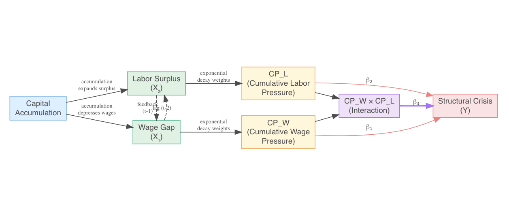
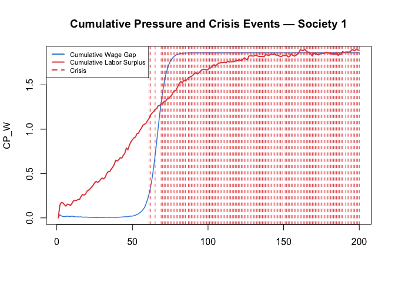
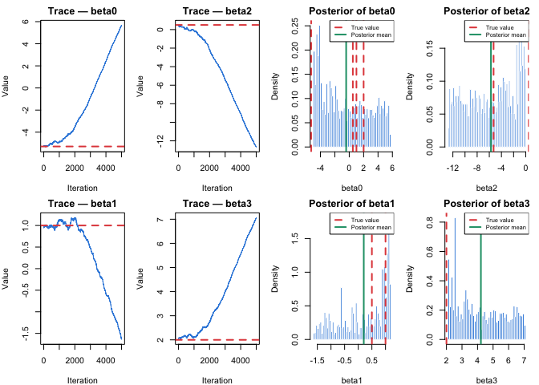
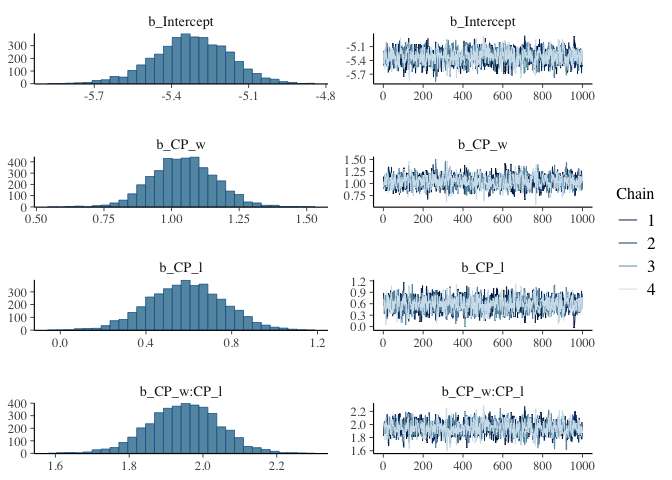
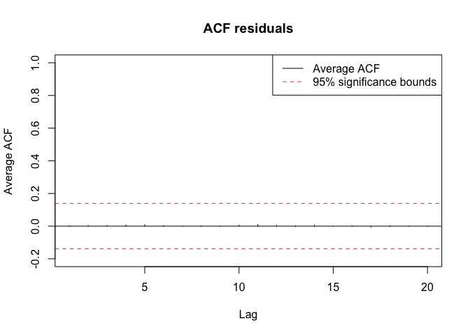

Wage Labour and Capital
================

### 1. Introduction

Reading Marx’s Wage Labour and Capital, I was intrigued by the
worker-capitalist relationship — specifically the tension between wages
determined by the law of supply and demand yet bounded below by the cost
of subsistence. Marx claimed that wages tend toward subsistence over
time, that labor surplus grows as capital accumulates, and that
structural crisis becomes inevitable past a certain threshold. Yet
despite the theoretical richness of these mechanisms, Marx reasoned
entirely in words and logical argument, never formalizing his claims as
quantitative, testable hypotheses — leaving open a fundamental question:
do these mechanisms, when expressed mathematically, actually produce the
dynamics he described?

In this project, the causal mechanisms of Wage Labour and Capital are
translated into a mathematical data generating process grounded in the
cliodynamics literature. To ensure that variables behave according to
theoretical mechanisms rather than being confounded by the complexity of
real historical processes, we rely on synthetic rather than empirical
historical data — allowing precise control over the data generating
process. The synthetic data is designed to replicate one fundamental
challenge of historical time series: the temporal dependence between
observations. A second challenge — the fragmentary and incomplete nature
of real historical archives — is acknowledged as a limitation and avenue
for future work.

The simulation is structured around two independent variables — wage gap
and labor surplus — whose dynamics are governed by theoretically
motivated structural equations developed in the following sections.
These variables feed into cumulative pressure terms ($CP_L$, $CP_W$),
which capture the accumulated effect of structural pressures over time
and predict the probability of structural crisis through a logistic
regression model with an interaction term formalizing Marx’s conjunction
hypothesis.

We observed N societies over T decades. To determine the sample size, we
used the **10 events per variable (EPV)** rule of thumb for logistic
regression. But two methodological challenges must be addressed. First,
the determination of N and T depends on the crisis probability and the
autocorrelation structure of the cumulative pressure variables. Second,
the cumulative pressure terms exhibit an **ARMA (1,q)** autocorrelation
structure, making analytical derivation of the **effective sample size
(ESS)** inappropriate. For these reasons, we proceed in two stages: a
pilot simulation with provisional parameters to empirically estimate the
autocorrelation structure, followed by the full simulation with final N
and T derived from both the empirical autocorrelation estimate and the
sensitivity analysis on crisis probability. Following the final
simulation, a sensitivity analysis on the structural parameters is
conducted to assess whether the core findings remain stable across
alternative parameter specifications.

Finally, we compare **frequentist and Bayesian approaches to parameter
recovery**, testing whether Marx’s structural parameters — including the
interaction term between wage depression and labor surplus — are
statistically detectable from synthetic historical data.

### 2. Theoretical Framework

#### The Directed Acyclic Graph (DAG)

``` r

```


**Capital accumulation** is the extra value created by workers and
reinvested to grow power and profit. Thus, it expands the **labor
surplus**, as workers must work more to generate higher profits for the
capitalist. At the same time, the **wage gap** widens: while the real
wage remains stagnant, the relative wage decreases because the cost of
subsistence tends to increase over time.

Since all past periods contribute to the current crisis, yet recent
events exert a disproportionate influence, we implemented a **cumulative
pressure structure** for both labor surplus and the wage gap. By
applying an exponential decay function, the model retains the influence
of all past periods while assigning greater weight to more recent
dynamics.

#### The Variables :

1.  The dependent variable : structural crisis

$P(crisis[t]) = logistic(z)$, with :

$$
z = \beta_0+\beta_1x_1+\beta_2x_2+\beta_3x_1x_2
$$

- $x_1$: cumulative wage gap

- $x_2$: cumulative labor surplus

- $x_1x_2$ : mutual reinforcement between wage gap and labor surplus

The structural crisis outcome $Y_t$ \~ $Bernoulli(pt)$ represents the
binary realization of accumulated structural pressure — does a
structural crisis occur in this decade or not? The probability
$P(crisis[t])$ is governed by a logistic function of the cumulative
pressure terms $CP_L$ and $CP_W$. This formulation captures the
threshold nature of structural crisis — pressure accumulates gradually
through wage depression and labor surplus until it crosses a critical
level, at which point crisis probability rises sharply. Marx explicitly
describes this intensification in Wage Labour and Capital: ‘in the same
measure in which the capitalists are compelled, by the movement
described above, to exploit the already existing gigantic means of
production on an ever-increasing scale, and for this purpose to set in
motion all the mainsprings of credit, in the same measure do they
increase the industrial earthquakes, in the midst of which the
commercial world can preserve itself only by sacrificing a portion of
its wealth, its products, and even its forces of production, to the gods
of the lower world — in short, the crises increase. They become more
frequent and more violent’ (Marx, 1849).

**The interaction term** : ($\beta_3x_1x_2$)

The interaction term $\beta_3x_1x_2$ formalizes the mutual reinforcement
between wage depression and labor surplus that Marx explicitly describes
in Wage Labour and Capital. In his summary of capital’s contradictions,
Marx traces how productive growth simultaneously extends the division of
labor, intensifies competition among workers, and depresses wages —
while also swelling the reserve army through the proletarianization of
small manufacturers: ‘the forest of outstretched arms, begging for work,
grows ever thicker, while the arms themselves grow ever leaner’ (Marx,
1849). This simultaneous thickening of labor surplus and shrinking of
wages is precisely what the interaction term captures — neither force
operates independently, but each amplifies the other. We explicitly
assume a multiplicative effect between the cumulative pressure terms,
such that the joint presence of wage depression and labor surplus
generates a disproportionate increase in crisis probability beyond their
additive contributions. While Marx does not explicitly distinguish
additive from multiplicative effects, the multiplicative assumption
reflects the theoretical logic of mutual reinforcement described above —
a hypothesis tested directly through the significance and magnitude of
$\beta_3$ in the parameter recovery analysis.

2.  The independent variables :

    - Labour surplus

$$
LaborSurplus(t) = \frac{K_l}{1+e^{-r_l(t-t_{0,l})}} + A e^{{-\delta_l}t}\cdot sin\frac{2t\pi}{P} + \epsilon
$$

- $\frac{K_l}{1+e^{-r_l(t-t_{0,l})}}$ : This term represents the
  logistic trend of labor surplus — the secular accumulation of the
  reserve army of labor across multiple boom-bust cycles. Its upward
  trajectory is driven by two compounding forces. First, each recovery
  absorbs fewer workers than the previous crisis displaced, leaving a
  residual surplus that accumulates over time. Second, technology
  progressively replaces labor — each new sector requires fewer workers
  than the one it displaced, meaning the trend never returns to its
  previous low. As Marx argues in Wage Labour and Capital, competition
  among capitalists drives the continuous introduction of machinery and
  greater division of labor, permanently swelling the reserve army: “the
  larger the army of workers among whom the labour is subdivided, the
  more gigantic the scale upon which machinery is introduced” (Marx,
  1849). The logistic shape reflects the self-reinforcing nature of this
  accumulation — slow growth in early capitalism accelerates as
  mechanization intensifies, before stabilizing as the system approaches
  its structural limits. The ceiling $K_l$ represents the maximum
  sustainable labor surplus — the point beyond which the system faces
  structural breakdown

- $A e^{{-\delta_l}t}\cdot sin\frac{2t\pi}{P} + \epsilon$ : This term
  captures the cyclical dynamics of labor surplus around the logistic
  trend. The sinusoidal component reflects the anarchic movement of
  capital described by Marx in Wage Labour and Capital: capital
  perpetually emigrates from sectors where prices fall below cost of
  production and immigrates into more profitable ones — “the high price
  produces an excessive immigration, and the low price an excessive
  emigration” (Marx, 1849). When $sin\frac{2t\pi}{P}$ \> 0, capital
  flight displaces workers, pushing labor surplus above the trend
  (Overproduction Phase). When $sin\frac{2t\pi}{P}$ \< 0, capital
  immigration into new sectors temporarily absorbs workers, pulling
  labor surplus below the trend (Recovery Phase).The exponential term
  $A e^{{-\delta_l}t}$ introduces amplitude modulation over time. Rather
  than producing strictly shrinking cycles, the visualization reveals
  heterogeneous cycle amplitudes — consistent with Marx’s
  characterization of capital movement as anarchic rather than regular.
  No two cycles are identical, reflecting the unpredictable timing and
  magnitude of capital reallocation across sectors. The noise term
  $\epsilon$ \~ $N(0, \sigma^2)$ captures additional stochastic
  variation around the deterministic cycle structure.

  - Wage gap

$$
WageGap(t) = \frac{K_w}{1+e^{-r_w(t-t_{0,w})}}
$$

The wage gap measures the distance between the nominal wage and the cost
of subsistence — the minimum expenditure required to reproduce the
worker’s labor power. As Marx illustrates in Wage Labour and Capital,
wages can fall in real terms even when nominal wages remain unchanged,
simply because the cost of subsistence rises: “the same money they
received in exchange less bread, meat, etc. Their wages fell, not
because the value of silver was less, but because the value of the means
of subsistence had increased” (Marx, 1849). This distinction between
nominal and real wages motivates modeling the wage gap directly — rather
than wages alone — as the relevant variable for structural crisis
prediction. The wage gap follows a logistic growth trajectory,
reflecting the gradual but self-reinforcing nature of wage depression
under capitalism. In the early phase — before the inflection point
$t_{0,w}$ — the gap remains small, as wages still cover subsistence
costs. Past the inflection point, the gap widens rapidly as labor
surplus accumulates and competitive pressure intensifies. The ceiling
$K_w$ represents the maximum sustainable wage gap — the point at which
wages can no longer cover subsistence costs and structural crisis
becomes inevitable.

$$
r_w = r_{base,w} + \alpha(LaborSurplus_{t-1})
$$

The growth rate $r_w$ is modeled as a function of lagged labor surplus,
reflecting Turchin and Nefedov’s (2009) empirical observation that
oversupply of labor leads to depressed wages — a mechanism Marx
identifies as the primary driver of wage depression in Wage Labour and
Capital.

### 3. Data Generating Process

#### 3.1 Pilot simulation

In the absence of precise empirical estimates for the structural
parameters, provisional values are assigned based on theoretical
plausibility, ensuring that the simulated dynamics are qualitatively
consistent with the mechanisms described in Marx’s Wage Labour and
Capital. Specifically, parameters are chosen so that labour surplus
follows a gradual logistic accumulation with dampened cyclical
fluctuations, wage gap exhibits a feedback driven S-shaped trajectory,
and cumulative pressures build meaningfully over time before the crisis
threshold is reached. While these provisional values cannot be formally
validated against historical data at this stage, a sensitivity analysis
is conducted after the final simulation to assess whether the core
findings, namely the reliable recovery of the logistic regression
parameters and the theoretically expected ordering $\beta_3$ \>
$\beta_1$ \> $\beta_2$, remain stable across alternative parameter
specifications. Robustness of the results across this range would
suggest that the conclusions are driven by the theoretical structure of
the model rather than by any specific parameter choice.

``` r
set.seed(123)
```

``` r
N_pilot <- 10
T_pilot <- 200
```

``` r
# labor_surplus parameters
K_l <- 1
r_l <- .05
t0_l  <- 50
A <- .5
P <- 20
delta_l <- .1

# wage_gap parameters
K_w <- 1
r_base <- .03
alpha <- .5
t0_w <- 60

# decay parameter (cumulative pressure)
delta_c <- 0.43
```

**Generate wage gap and labor surplus**

Labor surplus has to be generated before wage gap because the growth
rate $r_w$ of the logistic trend of the wage gap depends on labor
surplus

``` r
func_labor_surplus <- function(N,T) {
  
  labor_surplus <- matrix(NA, nrow = T , ncol = N)
  for (n in 1:N) {
    for (t in 1:T) {
    
      logistic_trend <- K_l/(1+exp(-r_l*(t-t0_l)))
      oscillation <- A * exp(-delta_l*t) * sin((2*t*pi)/P)
      epsilon <- rnorm(1, mean = 0, sd = .02)
    
      labor_surplus[t, n] <- logistic_trend + oscillation + epsilon
    }
  }
  return(labor_surplus)
}
```

``` r
labor_surplus <- func_labor_surplus(N_pilot, T_pilot)
head(labor_surplus)
```

    ##           [,1]      [,2]      [,3]      [,4]      [,5]      [,6]      [,7]
    ## [1,] 0.2080341 0.2632198 0.2177725 0.2407239 0.2263693 0.1993276 0.2316406
    ## [2,] 0.3191881 0.3500399 0.3004186 0.3232447 0.3106314 0.3029925 0.3086414
    ## [3,] 0.4179072 0.3814301 0.3740381 0.3860664 0.4038371 0.3863734 0.4037635
    ## [4,] 0.4112893 0.4207430 0.4093023 0.3795577 0.4329378 0.4072356 0.3949205
    ## [5,] 0.4012005 0.3903280 0.4120287 0.4144225 0.4041403 0.3476279 0.4112196
    ## [6,] 0.3950272 0.3512010 0.3277150 0.3565112 0.3636080 0.3815374 0.3826592
    ##           [,8]      [,9]     [,10]
    ## [1,] 0.1975213 0.2134632 0.1934563
    ## [2,] 0.3104856 0.3369219 0.3107003
    ## [3,] 0.4010300 0.3776531 0.3855866
    ## [4,] 0.4012459 0.3980018 0.4350140
    ## [5,] 0.4031671 0.3644072 0.4303639
    ## [6,] 0.3866248 0.3565370 0.3671156

``` r
func_wage_gap <- function(N, T, lab){
  
  wage_gap <- matrix(NA, nrow = T , ncol = N)
  for (n in 1:N) {
    for (t in 1:T) {
    
      if (t == 1) {r_w <- r_base} else {r_w <- r_base + alpha*(lab[t-1, n])}
    
     wage_gap[t,n]<- K_w/(1+exp(-r_w*(t-t0_w)))
    }
  }
  return(wage_gap)
}
```

``` r
wage_gap <- func_wage_gap(N_pilot, T_pilot, labor_surplus)
head(wage_gap)
```

    ##              [,1]         [,2]         [,3]         [,4]         [,5]
    ## [1,] 1.455423e-01 1.455423e-01 1.455423e-01 1.455423e-01 1.455423e-01
    ## [2,] 4.207760e-04 8.494896e-05 3.172819e-04 1.630987e-04 2.472881e-04
    ## [3,] 2.025963e-05 8.409528e-06 3.458935e-05 1.804771e-05 2.585462e-05
    ## [4,] 1.543584e-06 4.286465e-06 5.272155e-06 3.764619e-06 2.288897e-06
    ## [5,] 2.351501e-06 1.813171e-06 2.483568e-06 5.627511e-06 1.296566e-06
    ## [6,] 3.908258e-06 5.241719e-06 2.917515e-06 2.734915e-06 3.610041e-06
    ##              [,6]         [,7]         [,8]         [,9]        [,10]
    ## [1,] 1.455423e-01 1.455423e-01 1.455423e-01 1.455423e-01 1.455423e-01
    ## [2,] 5.415672e-04 2.122406e-04 5.706770e-04 3.595019e-04 6.420297e-04
    ## [3,] 3.214289e-05 2.736330e-05 2.596231e-05 1.222184e-05 2.580395e-05
    ## [4,] 3.732397e-06 2.293615e-06 2.476058e-06 4.764628e-06 3.815544e-06
    ## [5,] 2.628805e-06 3.688403e-06 3.099517e-06 3.388739e-06 1.224611e-06
    ## [6,] 1.660227e-05 2.981953e-06 3.706156e-06 1.055401e-05 1.778347e-06

The logistic formula of the wage gap is deterministic given the growth
rate $r_w$ and the time $t$. At $t=1$, $r_w = r_{base}$ because there is
no labor surplus before $t=1$. Therefore, the wage gap at $t=1$ is
identical for all societies, meaning that all societies start with the
same structural conditions but diverge as the market history evolves.

**Generate cumulative wage gap and cumulative labor surplus**

Weights are assigned inversely to chronological distance, prioritizing
recent events over earlier ones via an exponential decay factor.

      -   Cumulative labour surplus

$$
CP\_L(t) = \sum^{t-1}_{k} L_{t-k}\cdot e^{-\delta_c\cdot k}
$$

      -   Cumulative wage gap

$$
CP\_W(t) = \sum^{t-1}_{k} W_{t-k}\cdot e^{-\delta_c\cdot k}
$$

``` r
cp <- function(N, T, lab, wag) {
  
  CP_l <- matrix(NA, nrow = T , ncol = N)
  CP_w <- matrix(NA, nrow = T , ncol = N)

  for (n in 1:N){
    for (t in 1:T){
    
    # cumulative pressure is only meaningful at t=2
      if (t==1){
        CP_l[t, n] <- 0
        CP_w[t, n] <- 0
      }
      else {
      
        cpsum_l <- 0
        cpsum_w <- 0
      
        for (k in 1:(t-1)){
          cpsum_l <- cpsum_l + lab[t-k, n] * exp(-delta_c*k)
          cpsum_w <- cpsum_w + wag[t-k, n] * exp(-delta_c*k)
      }
      
        CP_l[t, n] <- cpsum_l
        CP_w[t, n] <- cpsum_w
      }
    }
  }
  return( list(CP_l = CP_l, CP_w = CP_w) )
}
```

``` r
result <- cp(N_pilot, T_pilot, labor_surplus, wage_gap)
CP_w <- result$CP_w
CP_l <- result$CP_l
```

``` r
head(CP_l)
```

    ##           [,1]      [,2]      [,3]      [,4]      [,5]      [,6]      [,7]
    ## [1,] 0.0000000 0.0000000 0.0000000 0.0000000 0.0000000 0.0000000 0.0000000
    ## [2,] 0.1353281 0.1712269 0.1416630 0.1565931 0.1472553 0.1296644 0.1506843
    ## [3,] 0.2956669 0.3390888 0.2875781 0.3121388 0.2978595 0.2814473 0.2987956
    ## [4,] 0.4641864 0.4687041 0.4303873 0.4541889 0.4564600 0.4344235 0.4570211
    ## [5,] 0.5695049 0.5785934 0.5462257 0.5423597 0.5785614 0.5475069 0.5541957
    ## [6,] 0.6314527 0.6302922 0.6233532 0.6223956 0.6392564 0.5822933 0.6280115
    ##           [,8]      [,9]     [,10]
    ## [1,] 0.0000000 0.0000000 0.0000000
    ## [2,] 0.1284894 0.1388597 0.1258451
    ## [3,] 0.2855572 0.3095003 0.2839767
    ## [4,] 0.4466312 0.4469995 0.4355570
    ## [5,] 0.5515518 0.5496810 0.5663144
    ## [6,] 0.6210533 0.5946227 0.6483483

``` r
head(CP_w)
```

    ##            [,1]       [,2]       [,3]       [,4]       [,5]       [,6]
    ## [1,] 0.00000000 0.00000000 0.00000000 0.00000000 0.00000000 0.00000000
    ## [2,] 0.09467661 0.09467661 0.09467661 0.09467661 0.09467661 0.09467661
    ## [3,] 0.06186171 0.06164326 0.06179439 0.06169409 0.06174886 0.06194029
    ## [4,] 0.04025479 0.04010497 0.04022031 0.04014431 0.04018501 0.04031363
    ## [5,] 0.02618711 0.02609144 0.02616711 0.02611669 0.02614221 0.02622681
    ## [6,] 0.01703648 0.01697390 0.01702356 0.01699280 0.01700659 0.01706249
    ##            [,7]       [,8]       [,9]      [,10]
    ## [1,] 0.00000000 0.00000000 0.00000000 0.00000000
    ## [2,] 0.09467661 0.09467661 0.09467661 0.09467661
    ## [3,] 0.06172606 0.06195923 0.06182185 0.06200564
    ## [4,] 0.04017116 0.04032193 0.04022363 0.04035202
    ## [5,] 0.02613320 0.02623139 0.02616894 0.02625184
    ## [6,] 0.01700228 0.01706578 0.01702534 0.01707786

- The identical wage gap at $t=2$ across all societies can be explain by
  the identical wage gap at $t=1$. At $t=2$, CP_w looks back one period,
  meaning it only uses data in $t=1$.

##### Estimation of the Autocorrelation Structure

The cumulative pressure series $CP_l$ and $CP_w$ are stochastic. Since
each society draws its own sequence of random shocks $\epsilon$ and
oscillation realizations, the autocorrelation function estimated from a
single society reflects idiosyncratic noise rather than the underlying
process structure shared by all societies. To obtain a more stable and
representative estimate of the autocorrelation structure, we average
across N societies. The estimation is further restricted to the
post-inflection phase, starting from $t_{0,l}$ and $t_{0,w}$. In the
pre-inflection phase, the logistic trend remains close to zero and the
cumulative pressures have not yet fully developed, which would bias the
autocorrelation estimate downward. The post-inflection phase, by
contrast, captures the mature dynamics of the system where structural
pressures have fully accumulated and the ARMA autocorrelation structure
is most clearly expressed empirically.

``` r
lag_max <- 20 
acf_matrix_l <- matrix(NA, nrow = lag_max , ncol = N_pilot)
acf_matrix_w <- matrix(NA, nrow = lag_max , ncol = N_pilot)
```

``` r
acf_func <- function(lag_max, acf_matrix, N, T, t0, CP) {
  for (s in 1:N){
    cps <- CP[t0:T, s]
    acf_matrix[,s] <- acf(cps, 
                          lag.max = lag_max,
                          plot = FALSE)$acf[-1]
  }
  acf_avg <- rowMeans(acf_matrix)
  return(acf_avg)
}
```

``` r
acf_avg_l <- acf_func(lag_max, acf_matrix_l, N_pilot, T_pilot, t0_l, CP_l)
acf_avg_w <- acf_func(lag_max, acf_matrix_w, N_pilot, T_pilot, t0_w, CP_w)
```

``` r
acf_plot <- function(acf, T, title = "Average ACF"){
  
   plot(1:lag_max, acf,
         type = "h",
         xlab = "Lag",
         ylab = "Average ACF",
         main = title,
         ylim = c(-0.2, 1))
    abline(h = 0)
          # Significance bounds
    abline(h =  1.96 / sqrt(T), lty = 2, col = "#E24B4A")
    abline(h = -1.96 / sqrt(T), lty = 2, col = "#E24B4A")
        
    legend("topright",
            legend = c("Average ACF", "95% significance bounds"),
            col    = c("black", "#E24B4A"),
            lty    = c(1, 2))
  
}
```

``` r
par(mfrow = c(1,2))
acf_plot(acf_avg_l, T_pilot, title = "ACF labor surplus")
acf_plot(acf_avg_w, T_pilot, title = "ACF wage gap" )
```

<!-- -->

``` r
par(mfrow = c(1,1))
```

Both variables exhibit **high autocorrelation as a consequence of their
ARMA(1,q) structure**. Yet, unlike the wage gap, which follows a
smoother trajectory, the labor surplus features dampened oscillations
that cause $CP\_L$ to retain more autocorrelation than $CP\_W$.

##### Derive T from the effective sample size (ESS)

In time series data, observations are not independent — each period
carries information from previous ones. The effective sample size T_eff
allows us to measure the **true amount of independent information** in
the raw sample T when observations are correlated.

$$
T_{eff} = \frac{T}{1+2\sum^{\infty}_{k=1}\rho(k)}
$$

- $T$ is T_pilot, the raw sample size, the total number of observed
  periods.
- $T_{eff}$ is the ESS — the equivalent number of independent
  observations after accounting for autocorrelation
- $\rho$ is the autocorrelation structure.

``` r
# Labor surplus
Tl_obs <- T_pilot - round(t0_l)
Tl_eff <- Tl_obs/(1+2*sum(acf_avg_l))

# Wage gap
Tw_obs <- T_pilot - round(t0_w)
Tw_eff <- Tw_obs/(1+2*sum(acf_avg_w))

ratio_w <- Tw_eff/Tw_obs
ratio_l <- Tl_eff/Tl_obs

cat("Effective sample size — labor surplus:",
    round(Tl_eff, 3), "\n")
```

    ## Effective sample size — labor surplus: 5.269

``` r
cat("Effective sample size — wage gap:",
    round(Tw_eff, 3), "\n")
```

    ## Effective sample size — wage gap: 15.436

``` r
cat("Efficiency ratio — wage gap:", 
    round(ratio_w, 3), "\n")
```

    ## Efficiency ratio — wage gap: 0.11

``` r
cat("Efficiency ratio — labor surplus:", 
    round(ratio_l, 3), "\n")
```

    ## Efficiency ratio — labor surplus: 0.035

``` r
cat("Usable decades — labor surplus:", Tl_obs, "\n")
```

    ## Usable decades — labor surplus: 150

``` r
cat("Usable decades — wage gap:", Tw_obs)
```

    ## Usable decades — wage gap: 140

The effective sample size represents the number of **independent,
non-redundant and unique** observations contained in a correlated time
series. $Tl_{eff}$ \< $Tw_{eff}$ is theorically expected, as the
oscillatory component introduces cyclical dependence that reduces the
effective information content of $CP\_L$ relative to $CP\_W$.

The usable decades represent the number of observed periods required to
accumulate a given number of truly independent observations. Due to the
high autocorrelation structure of each variable, the raw sample is
substantially larger than the effective one. For instance, each society
must be observed for roughly **150 decades to yield only 5 independent
observations from the labor surplus**. Similarly, roughly **140 decades
of observation per society are needed to accumulate 15 independent
observations from the wage gap.**

##### Derive N from the events per variable (EPV)

Following the **Events Per Variable rule**, which recommends a minimum
of 10 observed events per predictor to ensure reliable parameter
estimation in logistic regression, and given that our model contains 3
variables ($x_1$, $x_2$, $x_1x_2$), the minimum number of **expected
crisis events is 3×10=30**

$$
EPV = N\cdot T_{eff}\cdot p
$$

- $EPV$: expected crisis events
- $N$: number of societies
- $T_{eff}$: effective sample size
- $p$: crisis probability

Every predictor requires a sufficient number of independent observations
to ensure reliable parameter estimates. By setting $T_{eff}$ based on
$CP\_W$, we guarantee at least 5 independent observations for $CP\_L$.

Recall $P(crisis[t]) = logistic(z)$, with

$$
z = \beta_0+\beta_1x_1+\beta_2x_2+\beta_3x_1x_2
$$

To estimate N, we vary the crisis probability p across a theoretically
motivated range. p represents the baseline crisis probability when
$CP\_W = CP\_L = 0$, interpreted as the **minimum crisis probability**
at the onset of capitalism before structural contradictions accumulate.
Setting $CP_W = CP_L = 0$ isolates $\beta_0$ as the sole determinant of
the baseline probability, ensuring that the sensitivity analysis varies
only the intercept while holding the pressure dynamics fixed.

$$
p (crisis|CP\_W = 0, CP\_L = 0) = \frac{1}{1+e^{-\beta_0}}
$$

A sensitivity analysis is performed on p, deriving the corresponding
$\beta_0$ for each value through. It is performed across the range p
$\in$ {0.001, 0.005, 0.01, 0.02, 0.05}, reflecting theoretically
plausible baseline rates from near-impossible to rare.

$$
\beta_0 = log(\frac{p}{1-p})
$$

``` r
p <- c(0.001, 0.005, 0.01, 0.02, 0.05)
beta0_values <- qlogis(p)
epv <- 30
T_eff_binding <- Tw_eff

# N calculation for each p
sensitivity_analysis <- data.frame(
  crisis_prob = p ,
  beta0 = round(beta0_values, 4), 
  N_needed = ceiling(epv/(T_eff_binding*p))
)

print(sensitivity_analysis)
```

    ##   crisis_prob   beta0 N_needed
    ## 1       0.001 -6.9068     1944
    ## 2       0.005 -5.2933      389
    ## 3       0.010 -4.5951      195
    ## 4       0.020 -3.8918       98
    ## 5       0.050 -2.9444       39

According to the EPV rule, a minimum of 30 crisis events is required
across the entire dataset to reliably estimate the three parameters of
the logistic model. Since the effective sample size is fixed at
$Tw_{eff}$, the number of societies N required to accumulate 30
effective crisis observations is inversely proportional to the baseline
crisis probability p. Consequently, lower values of p demand
substantially larger N to compensate the rarity of crisis events.

##### Generate the structural crisis (y_pilot)

The baseline crisis probability p is calibrated from **Turchin and
Nefedov’s (2009)** observation that recurrent waves of state breakdown
occured approximately **three times over five centuries** of European
history — the calamitous fourteenth century, the iron century of
1550-1660, and the age of revolutions of 1789-1849. This implies a
**per-decade crisis probability of approximately p = 0.006**. This
motivates the lower end of our sensitivity analysis, consistent with
Marx’s argument in Wage Labour and Capital that structural crisis
require prolonged accumulation of contradictions before becoming
probable. The combination that mostly fits with this argument is
($p = 0.005$, $\beta_0 = -5.2933$, $N = 389$).

Then, we need to determine the parameters $\beta_1$ , $\beta_2$ ,
$\beta_3$.

``` r
beta0 <- -5.2933    
beta1 <- 1.0   # wage gap effect — moderate
beta2 <- 0.5   # labor surplus effect — smaller alone
beta3 <- 2.0   # interaction — largest, captures Marx's threshold
```

The ordering $\beta_3$ \> $\beta_1$ \> $\beta_2$ reflects three
theoretical priorities. The dominance of $\beta_3$ formalizes Marx’s
conjunctural argument that **structural crisis emerges primarly from the
simultaneous occurrence of wage depression and labor surplus.** The
ordering beta1 \> beta2 reflects the relatively stronger direct effect
of wage gap compared to labor surplus in isolation, consistent with
Marx’s emphasis on wage depression as the most visible manifestation of
capitalist contradiction in Wage Labour and Capital.

$$
z = \beta_0+\beta_1x_1+\beta_2x_2+\beta_3x_1x_2
$$

``` r
y_func <- function(beta0, beta1, beta2, beta3, CP_l, CP_w, T, N) {
  
  z <- beta0 + (beta1*CP_w) + (beta2*CP_l) + (beta3*CP_l*CP_w)
  p_crisis <- 1/(1+exp(-z))
  
  y <- matrix(rbinom(T*N, size = 1, prob = p_crisis), 
              ncol = N, nrow = T)
  
  return(y)
}
```

``` r
y_pilot <- y_func(beta0, beta1, beta2, beta3, CP_l, CP_w, T_pilot, N_pilot)
```

``` r
head(y_pilot)
```

    ##      [,1] [,2] [,3] [,4] [,5] [,6] [,7] [,8] [,9] [,10]
    ## [1,]    0    0    0    0    0    0    0    0    0     0
    ## [2,]    0    0    1    0    0    0    0    0    0     0
    ## [3,]    0    0    0    0    0    0    0    0    0     0
    ## [4,]    0    0    0    0    0    0    0    0    0     0
    ## [5,]    0    0    0    0    0    0    0    0    0     0
    ## [6,]    0    0    0    0    0    0    0    0    0     0

#### 3.2 Final simulation

For the final simulation, we set **N_final = 389 societies and T_final =
200**. This timeline spans the necessary pre- and post-inflection
decades. The choice to include exactly 150 post-inflection decades is
driven by the differing autocorrelation structures of our variables:
while these 150 decades translate to merely 5 effective independent
informations for labor surplus, they yield 15 independent observations
for the wage gap. The pre-inflection phase is retained to preserve the
theoretical warmup consistent with Marx’s early capitalism argument.
However, the labor surplus exhibits high autocorrelation, substantially
reducing the effective independent information per society. **To
compensate for this loss of independence and to satisfy the EPV rule of
a minimum of 30 effective crisis, N = 389 societies are required.**

``` r
N_final <- 389
T_final <- 200
```

``` r
# Generate labor surplus , wage gap, CP_l, CP_w, y with N_final, T_final 
labor_surplus_fin <- func_labor_surplus(N_final, T_final)
wage_gap_fin <- func_wage_gap(N_final, T_final, labor_surplus_fin)

cp_fin <- cp(N_final, T_final, labor_surplus_fin, wage_gap_fin)
CPfin_l <- cp_fin$CP_l
CPfin_w <- cp_fin$CP_w

y_final <- y_func(beta0, beta1, beta2, beta3, CPfin_l, CPfin_w, T_final, N_final)
```

``` r
# crisis event count comparison
data.frame (
  Simulation = c("Pilot","Final"),
  N = c(N_pilot, N_final),
  T = c(T_pilot, T_final),
  Total_crisis = c(sum(y_pilot), sum(y_final))
    )
```

    ##   Simulation   N   T Total_crisis
    ## 1      Pilot  10 200         1328
    ## 2      Final 389 200        51367

The substantial jump from 1328 to 51356 crises is an expected outcome
rather than a anomaly; it directly reflects the roughly 39-fold scaling
of the number of societies from $N_{pilot} = 10$ to $N_{final} = 389$

``` r
# compute logistic trend of labor surplus
logistic_trend_l <- K_l / (1 + exp(-r_l * (1:T_final - t0_l)))

# compute the logistic trend of CP_l
# by feeding only the logistic component into the CP formula

CPtrend_l <- numeric(T_final)
for (t in 2:T_final) {
  cpsum <- 0
  for (k in 1:(t-1)) {
    cpsum <- cpsum + logistic_trend_l[t - k] * exp(-delta_c * k)
  }
  CPtrend_l[t] <- cpsum
}

# --- control the x-axis range here ---
x_min <-1     
x_max <-T_final        
# ------------------------------------

# plot CP_l as the base
plot(1:T_final, CPfin_l[, 1], type = "l",
     xlab = "Decade", ylab = "Cumulative Pressure",
     main = "Cumulative Pressure Dynamics and Logistic Trend - Society 1",
     col  = "#378ADD", lwd = 2,
     xlim = c(x_min, x_max),
     ylim = c(0, max(CPfin_l[, 1], CPfin_w[, 1], CPtrend_l, na.rm = TRUE)))

# add CP_w
lines(1:T_final, CPfin_w[, 1], col = "#E24B4A", lwd = 2)

# add logistic trend
lines(1:T_final, CPtrend_l, col = "#2CA46E", lwd = 2, lty = 2)

# legend
legend("topleft",
       legend = c("CP_l (Cumulative Labour Surplus)",
                  "CP_w (Cumulative Wage Gap)",
                  "Logistic Trend (Labour Surplus)"),
       col   = c("#378ADD", "#E24B4A", "#2CA46E"),
       lty   = c(1, 1, 2), lwd = 2, cex = 0.8)
```

<!-- -->

#### 4. Parameter recovery analysis

##### 4.1 Frequentist approach

The true parameters are known by construction. By fitting the logistic
regression, we can validate whether the sample size N derived from the
EPV rule is sufficient to recover the true parameters, assess if a
standard logistic regression remains reliable under the ARMA(1,q)
autocorrelation structure of $CP_L$ and $CP_W$ and test whether the
parameter $\beta_3$ is detectable. Here, $\beta_3$ represents the
mathematical formalization of Marx’s argument that the interaction of
wage depression and labor surplus amplifies crisis emergence. This
approach allows us to determine whether the statistical model can
recover known parameters from synthetic data generated under controlled
conditions. **If the estimated parameters diverge substantially from the
true parameters, the model certainly cannot be trusted to estimate
unknown parameters from real historical data**

To fit the logistic regression, we will utilize two estimation
approaches and evaluate the differences in the resulting coefficients :

**Long format + glm()**

This is the cleanest approach for logistic regression in R: the NxT
matrices to a long format dataframe and fit the data straightforwardly.

``` r
df_long <- data.frame(
  society = rep(1:N_final, each = T_final), 
  decade = rep(1:T_final, times = N_final), 
  CP_w = as.vector(CPfin_w), 
  CP_l = as.vector(CPfin_l), 
  y = as.vector(y_final)
)
```

``` r
model <- glm(y~CP_w+CP_l+CP_w:CP_l, 
             data = df_long, 
             family = binomial(link = "logit"))
summary(model)
```

    ## 
    ## Call:
    ## glm(formula = y ~ CP_w + CP_l + CP_w:CP_l, family = binomial(link = "logit"), 
    ##     data = df_long)
    ## 
    ## Deviance Residuals: 
    ##     Min       1Q   Median       3Q      Max  
    ## -3.0409  -0.1131   0.1551   0.1779   3.2499  
    ## 
    ## Coefficients:
    ##             Estimate Std. Error z value Pr(>|z|)    
    ## (Intercept)  -5.2757     0.1643 -32.111  < 2e-16 ***
    ## CP_w          0.9709     0.1238   7.840  4.5e-15 ***
    ## CP_l          0.4115     0.2070   1.988   0.0468 *  
    ## CP_w:CP_l     2.0643     0.1041  19.836  < 2e-16 ***
    ## ---
    ## Signif. codes:  0 '***' 0.001 '**' 0.01 '*' 0.05 '.' 0.1 ' ' 1
    ## 
    ## (Dispersion parameter for binomial family taken to be 1)
    ## 
    ##     Null deviance: 99720  on 77799  degrees of freedom
    ## Residual deviance: 16615  on 77796  degrees of freedom
    ## AIC: 16623
    ## 
    ## Number of Fisher Scoring iterations: 7

**Custom Maximum Likelihood Estimation function**

This method shows what glm() is doing internally.

``` r
X <- cbind(
  intercept = 1, 
  CP_w = as.vector(CPfin_w), 
  CP_l = as.vector(CPfin_l), 
  interaction = as.vector(CPfin_w)*as.vector(CPfin_l)
)

y_vec <- as.vector(y_final)
```

``` r
log_likelihood <- function(beta, X, y) {
  
  z <- X %*% beta
  p <- 1/(1+exp(-z))
  ll <- sum(y*log(p + 1e-10) + (1-y)*log(1-p  + 1e-10))
  
  return(-ll)
}
```

``` r
results <- optim(
    par = c(0,0,0,0),
    fn = log_likelihood,
    X = X, 
    y = y_vec, 
    method = "BFGS", 
    hessian = TRUE
  )
```

``` r
data.frame(
  true = c(beta0, beta1, beta2, beta3), 
  estimated_1 = c(coef(model)), 
  estimated_2 = c(results$par)
)
```

    ##                true estimated_1 estimated_2
    ## (Intercept) -5.2933  -5.2756701  -5.2756283
    ## CP_w         1.0000   0.9708903   0.9708655
    ## CP_l         0.5000   0.4115181   0.4114584
    ## CP_w:CP_l    2.0000   2.0642727   2.0643072

The close alignment between the estimated and true parameters
demonstrates that both models successfully recover the parameters
derived from Marxian theory. This also validates our use of the EPV
rule, confirming that the sample size was sufficient for reliable
estimation. Furthermore, the estimated parameters maintain the expected
ordering ($\beta_3$ \> $\beta_2$ \> $\beta_1$), providing empirical
support for the theoretical argument regarding the dominance of the
interaction term. Finally, despite the autocorrelated structure of the
CP variables, standard logistic regression via glm() performs comparably
to the custom MLE. This suggests that, under this specific simulation
design, the autocorrelation does not introduce severe bias into the
estimates.

##### 4.2 Bayesian approach

The previous simulations used a frequentist framework, which treats
parameters as fixed, unknown values. However, because this project aims
to model the challenges of real historical data—where observations are
not truly independent—a Bayesian approach provides a more honest and
accurate quantification of uncertainty. Bayesian inference takes a
different view: instead of assuming fixed parameters, it treats them as
random variables with probability distributions. It combines our initial
beliefs (the prior) with the evidence from the data (the likelihood) to
produce updated beliefs (the posterior): **posterior ∝ likelihood ×
prior** .Rather than a single point estimate, the posterior captures the
full range of plausible parameter values, making uncertainty
quantification explicit. Since the posterior is typically analytically
intractable, we approximate it through sampling. To this end, we
implement two methods from the Markov Chain Monte Carlo (MCMC) family: a
manual Metropolis–Hastings sampler and Hamiltonian Monte Carlo.

      -   Manual Metropolis-Hastings

For our manual Metropolis-Hastings implementation, we assign Normal
priors to the model parameters. Specifically, we center the priors for
the parameters $\beta_0$, $\beta_1$, $\beta_2$ and $\beta_3$ at zero to
reflect a neutral initial assumption.

``` r
# log prior function 
log_prior <- function(beta){
  # beta0~Normal(0, 10)
  # beta1, beta2, beta3~Normal(0, 5)
  dnorm(beta[1], 0, 10, log = TRUE)+ 
  dnorm(beta[2], 0, 5, log = TRUE)+ 
  dnorm(beta[3], 0, 5, log = TRUE)+ 
  dnorm(beta[4], 0, 5, log = TRUE)
}

# Same log_likehood as we use in the manual implementation of the logistic regression.
log_posterior <- function(beta, X, y){
  log_prior(beta) + log_likelihood(beta, X, y)
}
```

``` r
manual_metropolis_hasting <- function(X, y, n_iter = 5000, proposal_sd = .05, model){
  
  # initialize the storage
  samples <- matrix(NA, nrow = n_iter, ncol = 4)
  colnames(samples) <- c("beta0","beta1","beta2", "beta3")
  
  # starting point 
  beta_current <- coef(model)
  
  # initialize the acceptance
  acceptance <- 0
  
  for (i in 1:n_iter){
    # add random noise to beta_current to get the beta_proposed
    beta_proposed <- beta_current + rnorm(4, mean = 0, sd = proposal_sd)
    # compute the log posterior ratio
    log_ratio <- log_posterior(beta_proposed, X, y) - log_posterior(beta_current, X, y)
    # accept or reject 
    if (log(runif(1)) < log_ratio) {
      beta_current <- beta_proposed # update beta_current
      acceptance <- acceptance + 1
    }
    samples[i,] <- beta_current
  }
  cat("Acceptance rate: ", round(acceptance/n_iter, 3), "\n")
  
  return(samples)
}
```

``` r
set.seed(42)
mcmc_samples <- manual_metropolis_hasting(X, y_vec, n_iter = 5000, proposal_sd = .05, model)
```

    ## Acceptance rate:  0.812

``` r
trace_plot <- function(sample){

    for (j in 1:4) {
      plot(sample[, j],
           type = "l",
           main = paste("Trace —", colnames(sample)[j]),
           xlab = "Iteration",
           ylab = "Value",
           col  = "#378ADD")
      abline(h = c(beta0, beta1, beta2, beta3)[j],
             col = "#E24B4A", lwd = 2, lty = 2)
    }
}

post_plot <- function(samples){
    # discard warm up 
  warm_up <- 1000 
  post_samples <- samples[(warm_up+1):(nrow(samples)), ]
  

  for(j in 1:4){
    param_name <- colnames(post_samples)[j]
    true_value <- c(beta0, beta1, beta2, beta3)
    
    hist(post_samples[,j], 
         breaks = 50, 
         main   = paste("Posterior of", param_name),
         xlab   = param_name,
         col    = "#378ADD",
         border = "white",
         freq   = FALSE)
    
      # true value
    abline(v = true_value, col = "#E24B4A", lwd = 2, lty = 2)
    
    # posterior mean
    abline(v = mean(post_samples[, j]), 
           col = "#1D9E75", lwd = 2)
    
    legend("topright",
           legend = c("True value", "Posterior mean"),
           col    = c("#E24B4A", "#1D9E75"),
           lty    = c(2, 1), lwd = 2, cex = 0.7)
  }
}
```

``` r
par(mfcol = c(2, 4), mar = c(4, 4, 2, 1))
trace_plot(mcmc_samples)
post_plot(mcmc_samples)
```

<!-- -->

``` r
par(mfrow = c(1, 1))
```

- $\beta_0$ , $\beta_2$ : The chain drifts immediately from the true
  value and stabilized in an incorrect plateau. This happens when the
  posterior has multiple modes : a result of the multicollinearity
  between $CP_W$ and $CP_L$ and the interaction term.
- $\beta_1$, $\beta_3$ : The chain is exploring but very inefficiently.
  The traces drift slowly and are highly autocorrelated. While
  convergence is eventually achieved, the inefficiency reflects the
  difficulty of isotropic proposals in navigating the correlated
  posterior geometry.

**Remediation — Standardized observations:** To optimize the
Metropolis-Hastings algorithm, the predictor matrix was standardized.
Putting all variables on the same scale prevents numerical instability
and symmetrizes the likelihood surface, making it much easier for the
algorithm’s random walk to navigate the parameters efficiently.
Centering the predictors before forming the interaction term removes the
artificial correlation that created the spurious modes, so chains no
longer get trapped ($\beta_0$ , $\beta_2$), placing all variables on a
common scale makes the posterior roughly round, so a single step size
works in every direction and the chain crosses it in normal strides
rather than baby steps ($\beta_1$, $\beta_3$).

``` r
# standardize X
X_std <- cbind(
  intercept = 1, 
  CP_w = scale(as.vector(CPfin_w))[,1], 
  CP_l = scale(as.vector(CPfin_l))[,1], 
  interaction = scale(as.vector(CPfin_w)*as.vector(CPfin_l))[,1]
)
```

``` r
model_std <- glm(y_vec~X_std-1, family = binomial)
```

``` r
# manual Metropolis Hasting with standardized observations X_std
set.seed(42)
mcmc_std <- manual_metropolis_hasting(X_std, y_vec, n_iter = 5000, proposal_sd = .05, model_std)
```

    ## Acceptance rate:  0.522

``` r
par(mfcol = c(2, 4), mar = c(4, 4, 2, 1))
trace_plot(mcmc_std)
post_plot(mcmc_std)
```

<!-- -->

``` r
par(mfrow = c(1, 1))
```

- $\beta_0$ : Initialized at 0 — far above the true value (-5.2933) —
  and takes \~2000 iterations to cross the true value. This indicates
  insufficient warmup; early post-warmup samples fail to represent the
  stationary distribution and contaminate the inference.
- $\beta_1$, $\beta_2$, $\beta_3$ : These parameters drift
  systematically downward from the true value and never recover. Because
  $\beta_0$ starts heavily overestimated,the model immediately
  compensates by pushing the slopes too low. Since the cumulative
  pressure terms $CP_W$ and $CP_L$ are positively correlated, , the
  sampler becomes trapped on a likelihood “ridge”— unable to distinguish
  the true parameter combination from false, compensatory ones.
  Consequently, even after $\beta_0$ crosses the true value, the trapped
  slopes force it to continue drifting downward to maintain the
  likelihood.

**Remediation — multivariate Normal proposal:** The compensatory trap
and likelihood “ridge” described above stem from extreme
multicollinearity: the positively correlated predictors ($CP_W$, $CP_L$
and their interaction term) lack the independent variation needed to
isolate the intercept and slopes. **A standard Metropolis-Hastings
algorithm updates parameters independently, blinding it to this joint
covariance and causing it to slide along these false compensatory
paths.** By implementing a multivariate Normal proposal, the sampler can
learn the underlying covariance structure and propose joint parameter
updates. **This allows $\beta_0$ and the slopes to move together in the
correct directions, effectively escaping the ridge and converging to the
true values.**

``` r
multivariate_normal_proposal <- function(X, y, n_iter = 5000, proposal_sd = .05, model){
  
  # initialize the storage
  samples <- matrix(NA, nrow = n_iter, ncol = 4)
  colnames(samples) <- c("beta0","beta1","beta2", "beta3")
  
  # starting point 
  beta_current <- coef(model)
  
  # initialize the acceptance
  acceptance <- 0
  
  step_cov <- vcov(model)*proposal_sd^2
  
  for (i in 1:n_iter){
    # add random noise to beta_current to get the beta_proposed
    beta_proposed <- mvrnorm(n = 1, mu = beta_current, Sigma = step_cov)
    # compute the log posterior ratio
    log_ratio <- log_posterior(beta_proposed, X, y) - log_posterior(beta_current, X, y)
    # accept or reject 
    if (log(runif(1)) < log_ratio) {
      beta_current <- beta_proposed # update beta_current
      acceptance <- acceptance + 1
    }
    samples[i,] <- beta_current
  }
  cat("Acceptance rate: ", round(acceptance/n_iter, 3), "\n")
  
  return(samples)
}
```

``` r
set.seed(42)
mnp_samples <- multivariate_normal_proposal(X, y_vec, n_iter = 5000, proposal_sd = .05, model)
```

    ## Acceptance rate:  0.698

``` r
par(mfcol = c(2, 4), mar = c(4, 4, 2, 1))
trace_plot(mnp_samples)
post_plot(mnp_samples)
```

<!-- -->

``` r
par(mfrow = c(1, 1))
```

- $\beta_0$ , $\beta_3$ : The chains cross the true value during the
  first iterations but subsequently drift upward and never recover,
  converging to a posterior mean that consistently overestimates the
  true value.
- $\beta_1$ , $\beta_2$ : The opposite pattern is observed, with chains
  drifting downward and converging to a posterior mean that
  underestimates the true value.

**Diagnosing convergence with the R-hat statistic:** The trace plots and
posterior distributions of the parameters suggest that the manual
Metropolis–Hastings sampler failed to achieve simultaneous convergence
across all parameters. To confirm this with a quantitative measure, we
compute the R-hat. **R-hat is a convergence diagnostic that compares the
variance between chains to the variance within each chain.** It
indicates whether the MCMC chains have converged to the same posterior
distribution: values close to 1 suggest convergence, while larger values
reveal that the chains are exploring different regions of the parameter
space.

**Between-chain variance** : This measures how different the two chain
means are from each other.

$$
B = \frac{N}{M-1} \sum^M_{m=1} (\hat{\psi}_m - \hat{\psi})^2
$$

- $M$ : number of chains.
- $N$ : number of post-warmup samples per chain.
- $\hat{\psi}_m$ : The mean of chain m.
- $\hat{\psi}$: The overall mean across all chain m.

**Within-chain variance** : This measures how much each chain varies
internally around its own mean.

$$
W = \frac{1}{M} \sum^M_{m=1} s^2_m
$$

- $s^2_m$ : The variance of the chain m.

**Estimated marginal posterior variance** : This combines B and W into
an estimate of the true posterior variance.

$$
\hat{var} = \frac{N-1}{N}W + \frac{1}{N}B
$$

**R-hat** :

$$
\hat{R} = \sqrt \frac{\hat{var}}{W}
$$

- $\hat{R}$ ≤ 1 : **Ideal convergence.** The chains have mixed well and
  accurately represent the target posterior distribution.
- $\hat{R}$ = 1.01 to 1.05 : **Minor concern.** The chains have largely
  converged, but there may be slight imperfections in mixing. Results
  are generally reliable, but inspecting trace plots or increasing
  iterations is recommended.
- $\hat{R}$ = 1.05 to 1.10 : **Serious concern.** The chains have not
  fully explored the parameter space; posterior summaries may be
  unstable or biased.
- $\hat{R}$ \> 1.10 : **Convergence failure.** The sampler failed to
  explore the posterior distribution. Results should not be trusted, and
  the model specification, priors, or sampler settings require revision.

``` r
compute_rhat <- function(samples) {
  
  n_params <- ncol(samples) 
  rhat <- numeric(n_params) # create an empty vector of Rhat
  
  for (j in 1:n_params) {
    chain <- samples[,j]
    N_total <- length(chain)
    
    # split the chain
    half <- floor(N_total/2)
    chain1 <- chain[1:half]
    chain2 <- chain[(half+1):(half*2)] # to make sure chain1 and chain2 have the same length
    
    # set N and M
    N <- half # length of each split chain
    M <- 2 # number of chains
    
    # chains mean
    psi_bar_1 <- mean(chain1)
    psi_bar_2 <- mean(chain2)
    psi <- mean(psi_bar_1, psi_bar_2)
    
    # between-chain variance
    B <- (N/(M-1)) * sum( (psi_bar_1 - psi)^2, (psi_bar_2 - psi)^2)
    
    # within chain variance 
    W <- (var(chain1)+var(chain2))/M
    
    # estimated marginal posterior variance 
    var_hat <- ((N-1)/N)* W + (1/N)*B
    
    # R-hat 
    rhat[j] <- sqrt(var_hat/W)
  }
  return(rhat)
}
```

``` r
rhat_mcmc_samples <- compute_rhat(mcmc_samples)
rhat_mcmc_std <- compute_rhat(mcmc_std)
rhat_mnp_samples <- compute_rhat(mnp_samples)
```

``` r
data.frame(
  parameters = c("beta0", "beta1", "beta2", "beta3"), 
  rhat1 = c(rhat_mcmc_samples), 
  rhat2 = c(rhat_mcmc_std), 
  rhat3 = c(rhat_mnp_samples)
)
```

    ##   parameters    rhat1    rhat2    rhat3
    ## 1      beta0 2.169829 3.853452 3.501115
    ## 2      beta1 1.281464 3.529730 2.744399
    ## 3      beta2 1.030176 2.329562 3.634332
    ## 4      beta3 2.040359 3.652906 3.443001

**R-hat results for the Metropolis–Hastings variants:** All three
samplers—standard Metropolis–Hastings, Metropolis–Hastings with
standardized predictors, and Metropolis–Hastings with a multivariate
normal proposal—fail the convergence test. With $\hat{R}$ values ranging
from 1.28 to 3.85, every variant lies far from the $\hat{R}$ ≤ 1
benchmark. These values quantitatively confirm the diagnosis suggested
by the trace plots: no variant achieves simultaneous convergence across
all four parameters. Notably, even in the best case (standard
Metropolis–Hastings, where $\beta_2$ $\hat{R}$ reaches 1.030176),
convergence occurs for a single parameter only, while the remaining
three fail badly. **This illustrates a key limitation: individual
parameters may appear well-behaved in isolation, yet the joint posterior
remains unreachable.** Moreover, the fact that refining the proposal
(standardization, multivariate structure) does not resolve the issue
suggests the bottleneck is not the tuning of the proposal, but the
random-walk nature of Metropolis–Hastings itself—reinforcing the need
for the gradient-based approach of HMC.

      -   Hamiltonian Monte Carlo

``` r
bayesian_model <- brm(
  formula = y~CP_w+CP_l+CP_w:CP_l, 
  data = df_long, 
  family = bernoulli(link = logit), 
  prior = c(
    prior(normal(0, 10), class = "Intercept"), 
    prior(normal(0, 5), class = "b")
  ), 
  chain = 4, 
  iter = 2000, 
  warmup = 1000, 
  seed = 42, 
  cores = 4, 
  control = list(
    adapt_delta = .95, 
    max_treedepth = 12
  )
)
```

    ## Compiling Stan program...

    ## Trying to compile a simple C file

    ## Start sampling

``` r
plot(bayesian_model)
```

<!-- -->

**Hamiltonian Monte Carlo results :** In contrast to the manual
Metropolis–Hastings sampler, the HMC chains converge for all four
parameters simultaneously. For each of $\beta_0$ , $\beta_1$ , $\beta_2$
, $\beta_3$ , the chains repeatedly cross the true value and remain
centered around it, indicating that the posterior means accurately
recover the true parameters. This success is expected.
Metropolis–Hastings explores the parameter space through a random walk,
which leads to slow mixing and weak exploration—especially when
parameters are correlated. HMC, by contrast, uses gradient information
to propose informed, long-range moves, allowing the chains to mix
efficiently and reach the target posterior much faster. This illustrates
why gradient-based samplers like HMC are the method of choice in modern
Bayesian software.

``` r
summary_bayesian <- summary(bayesian_model)
rhat <- summary_bayesian$fixed[, "Rhat"]

data.frame(
  data.frame(
  parameters = c("beta0", "beta1", "beta2", "beta3"), 
  rhat_mh_1 = c(rhat_mcmc_samples), 
  rhat_mh_2 = c(rhat_mcmc_std), 
  rhat_mh_3 = c(rhat_mnp_samples),
  rhat_hmc =  (rhat)
)
)
```

    ##   parameters rhat_mh_1 rhat_mh_2 rhat_mh_3 rhat_hmc
    ## 1      beta0  2.169829  3.853452  3.501115 1.003090
    ## 2      beta1  1.281464  3.529730  2.744399 1.004250
    ## 3      beta2  1.030176  2.329562  3.634332 1.001756
    ## 4      beta3  2.040359  3.652906  3.443001 1.004215

All parameters achieved $\hat{R} \approx 1$ with the Hamiltonian Monte
Carlo algorithm, confirming convergence across the four chains. In
contrast, the manual Metropolis-Hastings sampler failed to achieve
simultaneous convergence for all parameters.

#### 5. Time Series Diagnosis :

Assumption violation \> Coefficient biased \> overconfident model \>
inaccurate standard errors

**1. Comparison of the ACF of the pilot and final simulation :**

``` r
acfin_matrix_l <- matrix(NA, nrow = lag_max , ncol = N_final)
acfin_matrix_w <- matrix(NA, nrow = lag_max , ncol = N_final)

acfin_avg_l <- acf_func(lag_max, acfin_matrix_l, N_final, T_final, t0_l, CPfin_l)
acfin_avg_w <- acf_func(lag_max, acfin_matrix_w, N_final, T_final, t0_w, CPfin_w)
```

``` r
# compare acf pilot and acf final for labor surplus
acf_comp_l<- data.frame(lag = 1:lag_max, 
                        acf_final = acfin_avg_l, 
                        acf_pilot = acf_avg_l)

# compare acf pilot and acf final for wage gap
acf_comp_w <- data.frame(lag = 1:lag_max, 
                         acf_final = acfin_avg_w, 
                         acf_pilot = acf_avg_w)
```

``` r
acf_comparison <- function(acf_comp, title = "ACF Comparison: Final vs Pilot"){
  
  # convert to long format 
  acf_long <- pivot_longer(acf_comp, 
                           cols = c(acf_final, acf_pilot), 
                           names_to = "Type", 
                           values_to = "ACF_Values")
  
  p <- ggplot(acf_long, aes(x = lag, y = ACF_Values, color = Type, group = Type)) +
    geom_line(position = position_dodge(width = 0.2), linewidth = 1) + 
    geom_point(position = position_dodge(width = 0.2), size = 3) + 
    geom_hline(yintercept = 0, linetype = "dashed", color = "gray") +
    theme_minimal() +
   
    labs(title = title,        
         x = "Lag", 
         y = "ACF Value") +
    scale_color_manual(values = c("acf_final" = "steelblue", "acf_pilot" = "firebrick"))
  
  # Return the plot
  return(p) 
}
```

``` r
plot_wage <- acf_comparison(acf_comp_w, title = "ACF Comparison (wage gap)" )
plot_labor <-acf_comparison(acf_comp_l, title = "ACF Comparison (labor surplus)" )
combined_plot <- plot_wage + plot_labor
combined_plot
```

<!-- -->

As confirmed by the plots, the final and pilot simulations exhibit the
**same autocorrelation structure.** This alignment indicate two key
points:

- **Stability of the Data Generating Process (DGP):** The DGP is stable,
  meaning the underlying parameters consistently produce the same
  autocorrelation structure regardless of the sample size (N)

- **Validity of the Effective Sample Size (ESS):** The ESS derived from
  the pilot simulation remains valid for the final simulation, as the
  underlying autocorrelation structure has remained unchanged.

**2. Residual autocorrelation from logistic regression**

The ARMA(1,q) structure of $CP_w$ and $CP_l$ violates the logistic
regression assumption of independent observations. However, this does
not necessarily bias the estimated $\beta$ coefficients; rather, the
primary consequence is **inaccurate standard errors**. Because $CP_w$
and $CP_l$ are expected to capture the temporal structure, the residuals
should be uncorrelated. **The presence of correlated residuals can lead
to biased standard errors.**

``` r
residuals_pearson <- residuals(model, type = "pearson")
lag_max <- min(Tl_obs/4, 20)
df_long_ord <- df_long %>% arrange(society, decade)
acf_resid_matrix <- matrix (NA, nrow = lag_max, ncol = N_final)


for (s in 1:N_final){
  # Extract the residuals for society s
  res_s <- residuals_pearson[df_long$society == s]
  acf_resid_matrix[,s]<-acf(res_s, lag_max, plot = FALSE)$acf[-1]
}

avg_resid_matrix <- rowMeans(acf_resid_matrix)
```

``` r
acf_plot(avg_resid_matrix, T_final, title = "ACF residuals")
```

<!-- -->

Because the predictors $CP_W$ and $CP_L$ effectively explain the
autoregressive nature of the data, the model residuals exhibit
negligible autocorrelation, as demonstrated in the plots below.
