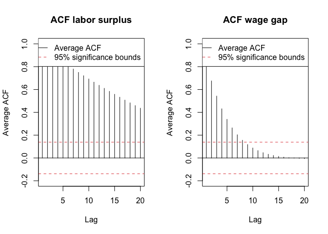
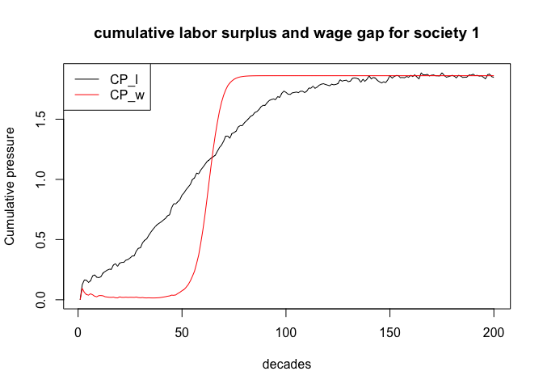

Wage Labour and Capital
================

In this project, we translated the theoretical framework of Marx’s Wage
Labour and Capital into a mathematical model. To ensure that the
variables behave according to the theoretical mechanisms describes in
the literature, rather than being confounded by the complexity of real
historical processes, we rely on synthetic data rather than empirical
historical data. This allow us to control the data generating process
precisely.

This simulation is structured around two independent variables : **wage
gap** and **labor surplus** whose dynamics are governed by theoretically
motivated equations developed in the following sections. These variables
feed into **cumulative pressure terms** ($CP_w$, $CP_l$), which in turn
predict the probability of **structural crisis** through a logistic
regression model.

We observed N societies over T decades. To determine the sample size, we
used the 10 events per variable (EPV) rule of thumb for logistic
regression. But two methodological challenges must be addressed. First,
the determination of N and T depends on the **crisis probability and the
autocorrelation structure of the cumulative pressure variables.**
Second, the cumulative pressure terms exhibit an **ARMA (1,q)**
autocorrelation structure, making analytical derivation of the effective
sample size (ESS) inappropriate. For these reasons, we proceed in two
stages: a pilot simulation with provisional parameters to empirically
**estimate the autocorrelation structure**, followed by the full
simulation with final **N and T derived from both the empirical
autocorrelation estimate and the sensitivity analysis on crisis
probability.**

Natural order : estimation of the empirical autocorrelation from the
pilot, derive T with the effective sample size (ESS) and N with the
events per variable (EPV).

#### The Variables :

A structural crisis occurrence at decade t can be translated in a
logistic regression with the possible output : *crisis, no crisis.*

$P(crisis[t]) = logistic(z)$, with :

$$
z = \beta_0+\beta_1x_1+\beta_2x_2+\beta_3x_1x_2
$$

- $x_1$: The wage gap measures the distance between the wage and the
  subsistence cost.

- $x_2$: The labor surplus is the excess of workers relative to
  available job

- $x_1x_2$ is the interaction term. It captures the idea that the effect
  of one variable depends on the level of the others. So when wage gap
  and labor surplus are high simultaneously, the combine effect on
  crisis probability is greater than their individual effects added
  together. The interaction term formalizes Marx’s argument that
  structural crisis emerges not from wage depression or labor surplus
  independently, but from their simultaneous occurrence — consistent
  with the threshold mechanism described in Wage Labour and Capital.

Following the Events Per Variable rule, which recommends a minimum of 10
observed events per predictor to ensure reliable parameter estimation in
logistic regression, and given that our model contains 3 variables
($x_1$, $x_2$, $x_1x_2$), the minimum number of expected crisis events
is 3×10=30

#### Data Generating Process

``` r
set.seed(123)
```

``` r
N_pilot <- 10
T_pilot <- 200
```

``` r
# labor_surplus parameters
K_l <- 1
r_l <- .05
t0_l  <- 50
A <- .2
P <- 5
delta_l <- .43
```

``` r
# wage_gap parameters
K_w <- 1
r_base <- .03
alpha <- .5
t0_w <- 60
```

``` r
# decay parameter
delta_c <- 0.43
```

``` r
# Initialize storage
labor_surplus <- matrix(NA, nrow = T_pilot , ncol = N_pilot)
wage_gap <- matrix(NA, nrow = T_pilot , ncol = N_pilot)
CP_l <- matrix(NA, nrow = T_pilot , ncol = N_pilot)
CP_w <- matrix(NA, nrow = T_pilot , ncol = N_pilot)
```

#### Generate wage gap and labor surplus

Labor surplus has to be generated before wage gap because the growth
rate $r_w$ of the logistic trend of the wage gap depends on labor
surplus

1.  Labor surplus : it represents the excess of workers relative to
    available job

$$
labor\_surplus (t) = \frac{K_l}{1+e^{-r_l(t-t_{0,l})}} + A e^{{-\delta_l}t}\cdot sin\frac{2t\pi}{P} + \epsilon
$$

``` r
for (n in 1:N_pilot) {
  for (t in 1:T_pilot) {
    
    logistic_trend <- K_l/(1+exp(-r_l*(t-t0_l)))
    oscillation <- A * exp(-delta_l*t) * sin((2*t*pi)/P)
    epsilon <- rnorm(1, mean = 0, sd = .02)
    
    labor_surplus[t, n] <- logistic_trend + oscillation + epsilon
  }
}
```

``` r
head(labor_surplus)
```

    ##            [,1]       [,2]       [,3]       [,4]       [,5]       [,6]
    ## [1,] 0.19196322 0.24714894 0.20170161 0.22465298 0.21029840 0.18325676
    ## [2,] 0.12831483 0.15916664 0.10954535 0.13237144 0.11975818 0.11211928
    ## [3,] 0.08587992 0.04940285 0.04201079 0.05403914 0.07180980 0.05434615
    ## [4,] 0.05847272 0.06792644 0.05648572 0.02674120 0.08012128 0.05441905
    ## [5,] 0.09793522 0.08706267 0.10876338 0.11115717 0.10087496 0.04436261
    ## [6,] 0.14846486 0.10463862 0.08115263 0.10994888 0.11704565 0.13497503
    ##            [,7]       [,8]       [,9]      [,10]
    ## [1,] 0.21556973 0.18145037 0.19739227 0.17738545
    ## [2,] 0.11776818 0.11961233 0.14604865 0.11982701
    ## [3,] 0.07173624 0.06900272 0.04562580 0.05355927
    ## [4,] 0.04210396 0.04842933 0.04518526 0.08219751
    ## [5,] 0.10795426 0.09990176 0.06114187 0.12709855
    ## [6,] 0.13609679 0.14006248 0.10997459 0.12055319

2.  Wage gap : it measures the distance between the wage and the
    subsistence cost.

$$
wage\_gap(t) = \frac{K_w}{1+e^{-r_w(t-t_{0,w})}}
$$

$$
r_w = r_{base,w} + \alpha(labor\_surplus_{t-1})
$$

``` r
for (n in 1:N_pilot) {
  for (t in 1:T_pilot) {
    
    if (t == 1) {r_w <- r_base} else {r_w <- r_base + alpha*(labor_surplus[t-1, n])}
    
    wage_gap[t,n]<- K_w/(1+exp(-r_w*(t-t0_w)))
  }
}
```

``` r
head(wage_gap)
```

    ##              [,1]        [,2]         [,3]         [,4]         [,5]
    ## [1,] 0.1455423289 0.145542329 0.1455423289 0.1455423289 0.1455423289
    ## [2,] 0.0006704215 0.000135376 0.0005055557 0.0002599045 0.0003940441
    ## [3,] 0.0046465507 0.001933961 0.0079072025 0.0041413392 0.0059221964
    ## [4,] 0.0165507000 0.044647597 0.0543564714 0.0394263593 0.0243475722
    ## [5,] 0.0370404840 0.028805036 0.0390395722 0.0842941217 0.0207684077
    ## [6,] 0.0138673882 0.018511248 0.0103885169 0.0097446576 0.0128228115
    ##             [,6]         [,7]         [,8]         [,9]       [,10]
    ## [1,] 0.145542329 0.1455423289 0.1455423289 0.1455423289 0.145542329
    ## [2,] 0.000862816 0.0003382043 0.0009091775 0.0005728145 0.001022810
    ## [3,] 0.007352031 0.0062656155 0.0059467181 0.0028082360 0.005910659
    ## [4,] 0.039102096 0.0243965410 0.0262861289 0.0493821876 0.039938387
    ## [5,] 0.041228463 0.0569009758 0.0482545875 0.0525208464 0.019638459
    ## [6,] 0.056370350 0.0106155291 0.0131597191 0.0365855432 0.006358015

The logistic formula of the wage gap is deterministic given the growth
rate $r_w$ and the time $t$. At $t=1$, $r_w = r_{base}$ because there is
no labor surplus before $t=1$. Therefore, the wage gap at $t=1$ is
identical for all societies, meaning that all societies start with the
same structural conditions but diverge as the market history evolves.

#### Generate cumulative wage gap and cumulative labor surplus

Weights are assigned inversely to chronological distance, prioritizing
recent events over earlier ones via an exponential decay factor.

$$
CP\_L(t) = \sum^{t-1}_{k} L_{t-k}\cdot e^{-\delta_c\cdot k}
$$

$$
CP\_W(t) = \sum^{t-1}_{k} W_{t-k}\cdot e^{-\delta_c\cdot k}
$$

``` r
for (n in 1:N_pilot){
  for (t in 1:T_pilot){
    
    # cumulative pressure is only meaningful at t=2
    if (t==1){
      CP_l[t, n] <- 0
      CP_w[t, n] <- 0
    }
    else {
      
      cpsum_l <- 0
      cpsum_w <- 0
      
      for (k in 1:(t-1)){
        cpsum_l <- cpsum_l + labor_surplus[t-k, n] * exp(-delta_c*k)
        cpsum_w <- cpsum_w + wage_gap[t-k, n] * exp(-delta_c*k)
      }
      
      CP_l[t, n] <- cpsum_l
      CP_w[t, n] <- cpsum_w
    }
  }
  }
```

``` r
head(CP_l)
```

    ##           [,1]      [,2]      [,3]      [,4]      [,5]      [,6]      [,7]
    ## [1,] 0.0000000 0.0000000 0.0000000 0.0000000 0.0000000 0.0000000 0.0000000
    ## [2,] 0.1248738 0.1607726 0.1312087 0.1461388 0.1368010 0.1192102 0.1402301
    ## [3,] 0.1647015 0.2081234 0.1566127 0.1811734 0.1668941 0.1504819 0.1678302
    ## [4,] 0.1630055 0.1675232 0.1292064 0.1530079 0.1552791 0.1332425 0.1558402
    ## [5,] 0.1440736 0.1531621 0.1207944 0.1169284 0.1531301 0.1220756 0.1287644
    ## [6,] 0.1574289 0.1562684 0.1493294 0.1483718 0.1652326 0.1082695 0.1539877
    ##           [,8]      [,9]     [,10]
    ## [1,] 0.0000000 0.0000000 0.0000000
    ## [2,] 0.1180351 0.1284055 0.1153908
    ## [3,] 0.1545918 0.1785349 0.1530114
    ## [4,] 0.1454503 0.1458186 0.1343761
    ## [5,] 0.1261205 0.1242497 0.1408831
    ## [6,] 0.1470295 0.1205989 0.1743245

``` r
head(CP_w)
```

    ##            [,1]       [,2]       [,3]       [,4]       [,5]       [,6]
    ## [1,] 0.00000000 0.00000000 0.00000000 0.00000000 0.00000000 0.00000000
    ## [2,] 0.09467661 0.09467661 0.09467661 0.09467661 0.09467661 0.09467661
    ## [3,] 0.06202411 0.06167606 0.06191686 0.06175707 0.06184432 0.06214926
    ## [4,] 0.04336987 0.04137890 0.04542119 0.04286751 0.04408274 0.04521122
    ## [5,] 0.03897888 0.05596102 0.06490628 0.05353291 0.04451454 0.05484658
    ## [6,] 0.04945129 0.05514109 0.06761772 0.08965774 0.04246715 0.06249769
    ##            [,7]       [,8]       [,9]      [,10]
    ## [1,] 0.00000000 0.00000000 0.00000000 0.00000000
    ## [2,] 0.09467661 0.09467661 0.09467661 0.09467661
    ## [3,] 0.06180800 0.06217942 0.06196062 0.06225334
    ## [4,] 0.04428251 0.04431667 0.04213273 0.04434130
    ## [5,] 0.04467634 0.04592777 0.05953128 0.05482470
    ## [6,] 0.06607697 0.06126648 0.07289093 0.04843897

- The identical wage gap at $t=2$ across all societies can be explain by
  the identical wage gap at $t=1$. At $t=2$, CP_w looks back one period,
  meaning it only uses data in $t=1$.

``` r
plot(1:T_pilot, CP_l[,1], type = "l", 
     xlab = "decades", ylab = "Cumulative pressure",
     main = "cumulative labor surplus and wage gap for society 1")
lines(1:T_pilot, CP_w[,1],col ="red")
legend("topleft", legend = c("CP_l", "CP_w"), col = c("black", "red"), lty = 1)
```

<!-- -->

**Phases of the labor surplus:**

“Wages will now rise, now fall,according to the relation of supply and
demand, according as competition shapes itself between the buyers of
labour-power, the capitalists, and the sellers of labour-power, the
workers.”

- *Phase 1: * Labor surplus is small and pre-inflection, driven by the
  logistic trend near zero plus random noise $\epsilon$. This represents
  the early **reserve army of labor** described by Marx — present but
  not yet structurally significant.

- *Phase 2: * New sectors emerge, temporarily increasing labor demand
  and absorbing surplus workers, which keeps the wage gap low. This is
  represented by the dampened oscillation:
  $A e^{{-\delta_l}t}\cdot sin\frac{2t\pi}{P}$ , when
  $sin\frac{2t\pi}{P}$ is negative: the oscillation pulls labor surplus
  below the trend.

- *Phase 3: * Labor surplus increases during the accumulation phase.
  During this phase, new technologies emerges and the capital grows.
  This leads to overproduction: more products in the market, the price
  falls, the profits collapse and profits collapse and workers are
  displaced by new technologies, swelling the reserve army. This is
  captured by $A e^{{-\delta_l}t}\cdot sin\frac{2t\pi}{P}$ , when
  $sin\frac{2t\pi}{P}$ is positive: the oscillation pushes above the
  trend. With each peak higher than the last as the logistic trend rises
  underneath.

``` r
n <- 40
trend_l <- K_l / (1 + exp(-r_l * (10:n - t0_l)))

# Main plot
plot(10:n, labor_surplus[10:n, 1], type = "n",
     xlab = "Decades", ylab = "Labor Surplus",
     main = "Labour Surplus with Logistic Trend - Society 1")


# Add lines on top of shading
lines(10:n, labor_surplus[10:n, 1], col = "#00070d", lwd = 1.5)
lines(10:n, trend_l, col = "#E24B4A", lty = 2, lwd = 2)

# Legend
legend("topleft",
       legend = c("Labor surplus", "Logistic trend"),
       col = c("#00070d", "#E24B4A"),
       lty = c(1, 2, 1, 1), lwd = 2)
```

<!-- -->

The plot below represent the Phase 2 and Phase 3 of the labor surplus
from decade 10 to decade 40. The dotted line is the **logistic trend**:
Phase 2 is the labor surplus below the trend, and Phase 3 is the labor
surplus above the trend.

Phase 2 and 3 are repeated over T, each cycle leaves more residual labor
surplus than the previous, then the cumulative reserve army grows
(logistic trend rises), the growing labor surplus feeds to the growth
rate of the wage gap equation
$r_w = r_{base,w} + \alpha(labor\_surplus_{t-1})$, and the wage gap
logistic curve steepens until it reaches its inflection point $t_{0,w}$.

A recovery occurs during the transition from Phase 3 to Phase 2,
prompted by the emergence of new sectors and a corresponding expansion
of the labor supply. Nevertheless, successive cycles (Phase 2, Phase 3,
and recovery) exhibit heterogeneity in their amplitude and periodicity.
This variance stems fundamentally from the **anarchic movement of
capital.**

#### Estimation of the Autocorrelation Structure

The cumulative pressure series $CP_l$ and $CP_w$ are stochastic. Since
each society draws its own sequence of random shocks $\epsilon$ and
oscillation realizations, the autocorrelation function estimated from a
single society reflects idiosyncratic noise rather than the underlying
process structure shared by all societies. To obtain a more stable and
representative estimate of the autocorrelation structure, we average
across N societies. The estimation is further restricted to the
post-inflection phase, starting from $t_{0,l}$ and $t_{0,w}$. In the
pre-inflection phase, the logistic trend remains close to zero and the
cumulative pressures have not yet fully developed, which would bias the
autocorrelation estimate downward. The post-inflection phase, by
contrast, captures the mature dynamics of the system where structural
pressures have fully accumulated and the ARMA autocorrelation structure
is most clearly expressed empirically.

**Labor surplus**

``` r
lag_max_l <- 20 
acf_matrix_l <- matrix(NA, nrow = lag_max_l , ncol = N_pilot)

for (s in 1:N_pilot) {
  cps_l <- CP_l[t0_l:N_pilot, s]
  acf_matrix_l [,s] <- acf(cps_l,
                    lag.max = lag_max_l,
                    plot = FALSE)$acf[-1]  # remove lag-0 (always 1)
}

acf_avg_l <- rowMeans(acf_matrix_l)
```

**Wage gap**

``` r
lag_max_w <- 20 
acf_matrix_w <- matrix(NA, nrow = lag_max_w , ncol = N_pilot)

for (s in 1:N_pilot) {
  cps_w <- CP_w[t0_w:N_pilot, s]
  acf_matrix_w [,s] <- acf(cps_w,
                    lag.max = lag_max_w,
                    plot = FALSE)$acf[-1]  # remove lag-0 (always 1)
}

acf_avg_w <- rowMeans(acf_matrix_w)
```

#### Derive T from the effective sample size (ESS)

In time series data, observations are not independent — each period
carries information from previous ones. The effective sample size T_eff
allows us to measure the **true amount of independent information** in
the raw sample T when observations are correlated.

$$
T_{eff} = \frac{T}{1+2\sum^{\infty}_{k=1}\rho(k)}
$$

- $T$ is T_pilot, the raw sample size, the total number of observed
  periods.
- $T_{eff}$ is the ESS — the equivalent number of independent
  observations after accounting for autocorrelation
- $\rho$ is the autocorrelation structure.

``` r
# Labor surplus
Tl_obs <- T_pilot - round(t0_l)
Tl_eff <- Tl_obs/(1+2*sum(acf_avg_l))

# Wage gap
Tw_obs <- T_pilot - round(t0_w)
Tw_eff <- Tw_obs/(1+2*sum(acf_avg_w))

ratio_w <- Tw_eff/Tw_obs
ratio_l <- Tl_eff/Tl_obs

cat("Effective sample size — labor surplus:",
    round(Tl_eff, 3), "\n")
```

    ## Effective sample size — labor surplus: 11.921

``` r
cat("Effective sample size — wage gap:",
    round(Tw_eff, 3), "\n")
```

    ## Effective sample size — wage gap: 20.559

``` r
cat("Efficiency ratio (T_eff/T_usable) — wage gap:", 
    round(ratio_w, 3), "\n")
```

    ## Efficiency ratio (T_eff/T_usable) — wage gap: 0.147

``` r
cat("Efficiency ratio (T_eff/T_usable) — labor surplus:", 
    round(ratio_l, 3), "\n")
```

    ## Efficiency ratio (T_eff/T_usable) — labor surplus: 0.079

``` r
cat("Usable decades for labor surplus (Tl_usable):" ,
    round(Tl_eff/ratio_l, 3), "\n")
```

    ## Usable decades for labor surplus (Tl_usable): 150

``` r
cat("Usable decades for wage gap (Tw_usable):" ,
    round(Tw_eff/ratio_w, 3))
```

    ## Usable decades for wage gap (Tw_usable): 140

The effective sample size represents the number of **independent,
non-redundant and unique** observations contained in a correlated time
series. Given the dampened oscillations in labor surplus, the cumulative
pressure $CP\_L$ carries additional autocorrelation than $CP\_W$, which
follows a smoother trajectory. Consequently, $Tl_{eff}$ \< $Tw_{eff}$ is
theorically expected, as the oscillatory component introduces cyclical
dependence that reduces the effective information content of $CP\_L$
relative to $CP\_W$.

The usable decades represent the number of observed periods required to
accumulate a given number of truly independent observations. Due to the
high autocorrelation structure of each variable, the raw sample is
substantially larger than the effective one. For instance, each society
must be observed for roughly **150 decades to yield only 11 independent
observations from the labor surplus**. Similarly, roughly **140 decades
of observation per society are needed to accumulate 20 independent
observations from the wage gap.**

#### Derive N from the events per variable (EPV)

$$
EPV = N\cdot T_{eff}\cdot p
$$

- $EPV$: expected crisis events
- $N$: number of societies
- $T_{eff}$: effective sample size
- $p$: crisis probability

Every predictor requires a sufficient number of independent observations
to ensure reliable parameter estimates. By setting $T_{eff}$ based on
$CP\_L$, we guarantee at least 11 independent observations for the most
autocorrelated variable. Meanwhile, $CP\_W$ automatically yields an
excess of observations given its lower autocorrelation, making $CP\_L$
the binding constraint.

Both $N$ and $p$ are unknown. We will start by estimating p with the
parameters $\beta$.

Recall $P(crisis[t]) = logistic(z)$, with

$$
z = \beta_0+\beta_1x_1+\beta_2x_2+\beta_3x_1x_2
$$
