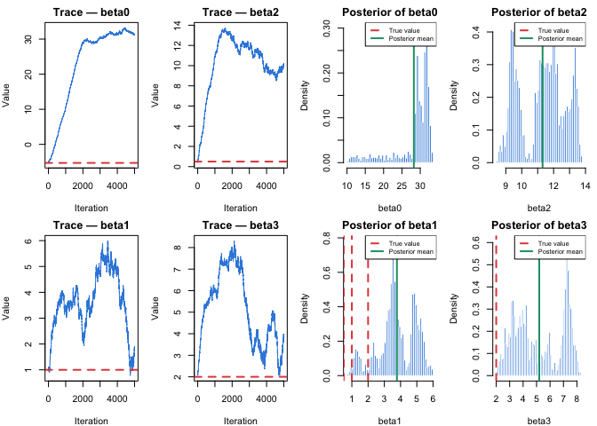
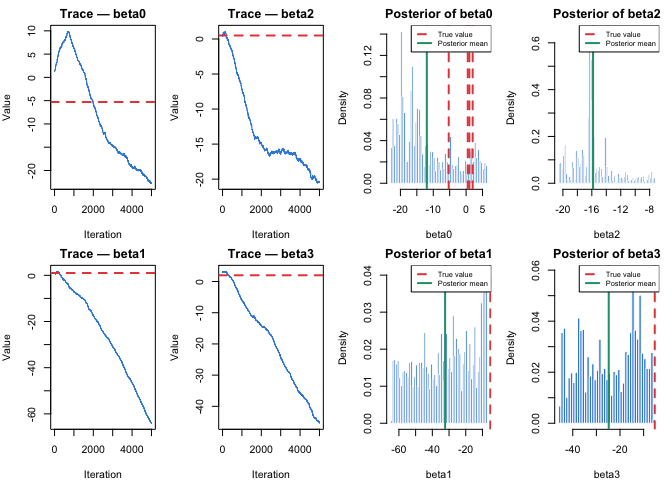
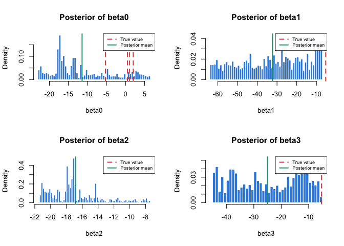

Wage Labour and Capital
================

In this project, we translated the theoretical framework of Marx’s Wage
Labour and Capital into a mathematical model. To ensure that the
variables behave according to the theoretical mechanisms describes in
the literature, rather than being confounded by the complexity of real
historical processes, **we rely on synthetic data rather than empirical
historical data. This allow us to control the data generating process
precisely.**

This simulation is structured around two independent variables : **wage
gap** and **labor surplus** whose dynamics are governed by theoretically
motivated equations developed in the following sections. These variables
feed into **cumulative pressure terms** ($CP_w$, $CP_l$), which in turn
predict the probability of **structural crisis** through a logistic
regression model.(+DAG)

We observed N societies over T decades. To determine the sample size, we
used the 10 events per variable (EPV) rule of thumb for logistic
regression. But two methodological challenges must be addressed. First,
the determination of N and T depends on the **crisis probability and the
autocorrelation structure of the cumulative pressure variables.**
Second, the cumulative pressure terms exhibit an **ARMA (1,q)**
autocorrelation structure, making analytical derivation of the effective
sample size (ESS) inappropriate. For these reasons, we proceed in two
stages: a pilot simulation with provisional parameters to empirically
**estimate the autocorrelation structure**, followed by the full
simulation with final **N and T derived from both the empirical
autocorrelation estimate and the sensitivity analysis on crisis
probability.**

Natural order : estimation of the empirical autocorrelation from the
pilot, derive T with the effective sample size (ESS) and N with the
events per variable (EPV).

#### The Variables :

A structural crisis occurrence at decade t can be translated in a
logistic regression with the possible output : *crisis, no crisis.*

$P(crisis[t]) = logistic(z)$, with :

$$
z = \beta_0+\beta_1x_1+\beta_2x_2+\beta_3x_1x_2
$$

- $x_1$: The wage gap measures the distance between the wage and the
  subsistence cost.

- $x_2$: The labor surplus is the excess of workers relative to
  available job

- $x_1x_2$ is the interaction term. It captures the idea that the effect
  of one variable depends on the level of the others. So when wage gap
  and labor surplus are high simultaneously, the combine effect on
  crisis probability is greater than their individual effects added
  together. The interaction term formalizes Marx’s argument that
  structural crisis emerges not from wage depression or labor surplus
  independently, but from their simultaneous occurrence — consistent
  with the threshold mechanism described in Wage Labour and Capital.

Following the **Events Per Variable rule**, which recommends a minimum
of 10 observed events per predictor to ensure reliable parameter
estimation in logistic regression, and given that our model contains 3
variables ($x_1$, $x_2$, $x_1x_2$), the minimum number of **expected
crisis events is 3×10=30**

#### Data Generating Process : Pilot Simulation

``` r
set.seed(123)
```

``` r
N_pilot <- 10
T_pilot <- 200
```

#### Generate wage gap and labor surplus

Labor surplus has to be generated before wage gap because the growth
rate $r_w$ of the logistic trend of the wage gap depends on labor
surplus

1.  Labor surplus :

$$
LaborSurplus(t) = \frac{K_l}{1+e^{-r_l(t-t_{0,l})}} + A e^{{-\delta_l}t}\cdot sin\frac{2t\pi}{P} + \epsilon
$$

``` r
# labor_surplus parameters
K_l <- 1
r_l <- .05
t0_l  <- 50
A <- .2
P <- 5
delta_l <- .43
```

``` r
func_labor_surplus <- function(N,T) {
  
  labor_surplus <- matrix(NA, nrow = T , ncol = N)
  for (n in 1:N) {
    for (t in 1:T) {
    
      logistic_trend <- K_l/(1+exp(-r_l*(t-t0_l)))
      oscillation <- A * exp(-delta_l*t) * sin((2*t*pi)/P)
      epsilon <- rnorm(1, mean = 0, sd = .02)
    
      labor_surplus[t, n] <- logistic_trend + oscillation + epsilon
    }
  }
  return(labor_surplus)
}
```

``` r
labor_surplus <- func_labor_surplus(N_pilot, T_pilot)
head(labor_surplus)
```

    ##            [,1]       [,2]       [,3]       [,4]       [,5]       [,6]
    ## [1,] 0.19196322 0.24714894 0.20170161 0.22465298 0.21029840 0.18325676
    ## [2,] 0.12831483 0.15916664 0.10954535 0.13237144 0.11975818 0.11211928
    ## [3,] 0.08587992 0.04940285 0.04201079 0.05403914 0.07180980 0.05434615
    ## [4,] 0.05847272 0.06792644 0.05648572 0.02674120 0.08012128 0.05441905
    ## [5,] 0.09793522 0.08706267 0.10876338 0.11115717 0.10087496 0.04436261
    ## [6,] 0.14846486 0.10463862 0.08115263 0.10994888 0.11704565 0.13497503
    ##            [,7]       [,8]       [,9]      [,10]
    ## [1,] 0.21556973 0.18145037 0.19739227 0.17738545
    ## [2,] 0.11776818 0.11961233 0.14604865 0.11982701
    ## [3,] 0.07173624 0.06900272 0.04562580 0.05355927
    ## [4,] 0.04210396 0.04842933 0.04518526 0.08219751
    ## [5,] 0.10795426 0.09990176 0.06114187 0.12709855
    ## [6,] 0.13609679 0.14006248 0.10997459 0.12055319

2.  Wage gap :

$$
WageGap(t) = \frac{K_w}{1+e^{-r_w(t-t_{0,w})}}
$$

$$
r_w = r_{base,w} + \alpha(LaborSurplus_{t-1})
$$

``` r
# wage_gap parameters
K_w <- 1
r_base <- .03
alpha <- .5
t0_w <- 60
```

``` r
func_wage_gap <- function(N, T, lab){
  
  wage_gap <- matrix(NA, nrow = T , ncol = N)
  for (n in 1:N) {
    for (t in 1:T) {
    
      if (t == 1) {r_w <- r_base} else {r_w <- r_base + alpha*(lab[t-1, n])}
    
     wage_gap[t,n]<- K_w/(1+exp(-r_w*(t-t0_w)))
    }
  }
  return(wage_gap)
}
```

``` r
wage_gap <- func_wage_gap(N_pilot, T_pilot, labor_surplus)
head(wage_gap)
```

    ##              [,1]        [,2]         [,3]         [,4]         [,5]
    ## [1,] 0.1455423289 0.145542329 0.1455423289 0.1455423289 0.1455423289
    ## [2,] 0.0006704215 0.000135376 0.0005055557 0.0002599045 0.0003940441
    ## [3,] 0.0046465507 0.001933961 0.0079072025 0.0041413392 0.0059221964
    ## [4,] 0.0165507000 0.044647597 0.0543564714 0.0394263593 0.0243475722
    ## [5,] 0.0370404840 0.028805036 0.0390395722 0.0842941217 0.0207684077
    ## [6,] 0.0138673882 0.018511248 0.0103885169 0.0097446576 0.0128228115
    ##             [,6]         [,7]         [,8]         [,9]       [,10]
    ## [1,] 0.145542329 0.1455423289 0.1455423289 0.1455423289 0.145542329
    ## [2,] 0.000862816 0.0003382043 0.0009091775 0.0005728145 0.001022810
    ## [3,] 0.007352031 0.0062656155 0.0059467181 0.0028082360 0.005910659
    ## [4,] 0.039102096 0.0243965410 0.0262861289 0.0493821876 0.039938387
    ## [5,] 0.041228463 0.0569009758 0.0482545875 0.0525208464 0.019638459
    ## [6,] 0.056370350 0.0106155291 0.0131597191 0.0365855432 0.006358015

The logistic formula of the wage gap is deterministic given the growth
rate $r_w$ and the time $t$. At $t=1$, $r_w = r_{base}$ because there is
no labor surplus before $t=1$. Therefore, the wage gap at $t=1$ is
identical for all societies, meaning that all societies start with the
same structural conditions but diverge as the market history evolves.

#### Generate cumulative wage gap and cumulative labor surplus

Weights are assigned inversely to chronological distance, prioritizing
recent events over earlier ones via an exponential decay factor.

$$
CP\_L(t) = \sum^{t-1}_{k} L_{t-k}\cdot e^{-\delta_c\cdot k}
$$

$$
CP\_W(t) = \sum^{t-1}_{k} W_{t-k}\cdot e^{-\delta_c\cdot k}
$$

``` r
# decay parameter (cumulative pressure)
delta_c <- 0.43
```

``` r
cp <- function(N, T, lab, wag) {
  
  CP_l <- matrix(NA, nrow = T , ncol = N)
  CP_w <- matrix(NA, nrow = T , ncol = N)

  for (n in 1:N){
    for (t in 1:T){
    
    # cumulative pressure is only meaningful at t=2
      if (t==1){
        CP_l[t, n] <- 0
        CP_w[t, n] <- 0
      }
      else {
      
        cpsum_l <- 0
        cpsum_w <- 0
      
        for (k in 1:(t-1)){
          cpsum_l <- cpsum_l + lab[t-k, n] * exp(-delta_c*k)
          cpsum_w <- cpsum_w + wag[t-k, n] * exp(-delta_c*k)
      }
      
        CP_l[t, n] <- cpsum_l
        CP_w[t, n] <- cpsum_w
      }
    }
  }
  return( list(CP_l = CP_l, CP_w = CP_w) )
}
```

``` r
result <- cp(N_pilot, T_pilot, labor_surplus, wage_gap)
CP_w <- result$CP_w
CP_l <- result$CP_l
```

``` r
head(CP_l)
```

    ##           [,1]      [,2]      [,3]      [,4]      [,5]      [,6]      [,7]
    ## [1,] 0.0000000 0.0000000 0.0000000 0.0000000 0.0000000 0.0000000 0.0000000
    ## [2,] 0.1248738 0.1607726 0.1312087 0.1461388 0.1368010 0.1192102 0.1402301
    ## [3,] 0.1647015 0.2081234 0.1566127 0.1811734 0.1668941 0.1504819 0.1678302
    ## [4,] 0.1630055 0.1675232 0.1292064 0.1530079 0.1552791 0.1332425 0.1558402
    ## [5,] 0.1440736 0.1531621 0.1207944 0.1169284 0.1531301 0.1220756 0.1287644
    ## [6,] 0.1574289 0.1562684 0.1493294 0.1483718 0.1652326 0.1082695 0.1539877
    ##           [,8]      [,9]     [,10]
    ## [1,] 0.0000000 0.0000000 0.0000000
    ## [2,] 0.1180351 0.1284055 0.1153908
    ## [3,] 0.1545918 0.1785349 0.1530114
    ## [4,] 0.1454503 0.1458186 0.1343761
    ## [5,] 0.1261205 0.1242497 0.1408831
    ## [6,] 0.1470295 0.1205989 0.1743245

``` r
head(CP_w)
```

    ##            [,1]       [,2]       [,3]       [,4]       [,5]       [,6]
    ## [1,] 0.00000000 0.00000000 0.00000000 0.00000000 0.00000000 0.00000000
    ## [2,] 0.09467661 0.09467661 0.09467661 0.09467661 0.09467661 0.09467661
    ## [3,] 0.06202411 0.06167606 0.06191686 0.06175707 0.06184432 0.06214926
    ## [4,] 0.04336987 0.04137890 0.04542119 0.04286751 0.04408274 0.04521122
    ## [5,] 0.03897888 0.05596102 0.06490628 0.05353291 0.04451454 0.05484658
    ## [6,] 0.04945129 0.05514109 0.06761772 0.08965774 0.04246715 0.06249769
    ##            [,7]       [,8]       [,9]      [,10]
    ## [1,] 0.00000000 0.00000000 0.00000000 0.00000000
    ## [2,] 0.09467661 0.09467661 0.09467661 0.09467661
    ## [3,] 0.06180800 0.06217942 0.06196062 0.06225334
    ## [4,] 0.04428251 0.04431667 0.04213273 0.04434130
    ## [5,] 0.04467634 0.04592777 0.05953128 0.05482470
    ## [6,] 0.06607697 0.06126648 0.07289093 0.04843897

- The identical wage gap at $t=2$ across all societies can be explain by
  the identical wage gap at $t=1$. At $t=2$, CP_w looks back one period,
  meaning it only uses data in $t=1$.

``` r
n <- 70
s <- 50
trend_l <- K_l / (1 + exp(-r_l * (s:n - t0_l)))
 
par(mfrow = c(1,2))

plot(s:n, labor_surplus[s:n, 1], type = "n",
     xlab = "Decades", ylab = "Labor Surplus",
     main = "Labor Surplus with Trend")
lines(s:n, labor_surplus[s:n, 1], col = "#00070d", lwd = 1.5)
lines(s:n, trend_l, col = "#E24B4A", lty = 2, lwd = 2)
legend("topleft",
       legend = c("Labor surplus", "Logistic trend"),
       col = c("#00070d", "#E24B4A"),
       lty = c(1, 2, 1, 1), lwd = 2)

plot(1:T_pilot, CP_l[,1], type = "l", 
     xlab = "Decades", ylab = "Cumulative Pressure",
     main = "Cumulative Pressure")
lines(1:T_pilot, CP_w[,1],col ="red")
legend("bottomright", legend = c("CP_l", "CP_w"), col = c("black", "red"), lty = 1)
```

<!-- -->

``` r
par(mfrow = c(1, 1))
```

“Wages will now rise, now fall,according to the relation of supply and
demand, according as competition shapes itself between the buyers of
labour-power, the capitalists, and the sellers of labour-power, the
workers.”

The first plot illustrates the labor surplus of Society 1 from decade 50
(pre-inflection) to decade 70 (post-inflection), with the dotted line
representing the logistic trend. The second plot displays the cumulative
wage gap and labor surplus across the $T_{pilot}$

**Phases of labor surplus:**

- Phase 1: Labor surplus is small, driven by the logistic trend near
  zero plus random noise $\epsilon$. This represents the early **reserve
  army of labor** described by Marx — present but not yet structurally
  significant.

- Phase 2: New sectors emerge, temporarily increasing labor demand and
  absorbing surplus workers, which keeps the wage gap low. This is
  represented by the dampened oscillation:
  $A e^{{-\delta_l}t}\cdot sin\frac{2t\pi}{P}$ , when
  $sin\frac{2t\pi}{P}$ is negative: the oscillation pulls labor surplus
  below the trend.

- Phase 3: Labor surplus increases during the accumulation phase. During
  this phase, new technologies emerges and the capital grows. This leads
  to overproduction: more products in the market, the price falls, the
  profits collapse and workers are displaced by new technologies,
  swelling the reserve army. This is captured by
  $A e^{{-\delta_l}t}\cdot sin\frac{2t\pi}{P}$ , when
  $sin\frac{2t\pi}{P}$ is positive: the oscillation pushes above the
  trend. With each peak higher than the last as the logistic trend rises
  underneath.

**Phase 2 and 3 are repeated over T**, each cycle leaves more residual
labor surplus than the previous, then **the cumulative reserve army
grows (logistic trend rises)**, the growing labor surplus feeds to the
growth rate of the wage gap equation
$r_w = r_{base,w} + \alpha(labor\_surplus_{t-1})$, and the **wage gap
logistic curve steepens until it reaches its inflection point**
$t_{0,w}$.

A recovery occurs during the transition from Phase 3 to Phase 2,
prompted by the emergence of new sectors and a corresponding expansion
of the labor supply. Nevertheless, successive cycles (Phase 2, Phase 3,
and recovery) exhibit **heterogeneity in their amplitude and
periodicity**. This variance stems fundamentally from the **anarchic
movement of the capital.**

#### Estimation of the Autocorrelation Structure

The cumulative pressure series $CP_l$ and $CP_w$ are stochastic. Since
each society draws its own sequence of random shocks $\epsilon$ and
oscillation realizations, the autocorrelation function estimated from a
single society reflects idiosyncratic noise rather than the underlying
process structure shared by all societies. To obtain a more stable and
representative estimate of the autocorrelation structure, we average
across N societies. The estimation is further restricted to the
post-inflection phase, starting from $t_{0,l}$ and $t_{0,w}$. In the
pre-inflection phase, the logistic trend remains close to zero and the
cumulative pressures have not yet fully developed, which would bias the
autocorrelation estimate downward. The post-inflection phase, by
contrast, captures the mature dynamics of the system where structural
pressures have fully accumulated and the ARMA autocorrelation structure
is most clearly expressed empirically.

**Labor surplus**

``` r
lag_max <- 20 
acf_matrix_l <- matrix(NA, nrow = lag_max , ncol = N_pilot)
acf_matrix_w <- matrix(NA, nrow = lag_max , ncol = N_pilot)
```

``` r
acf_func <- function(lag_max, acf_matrix, N, T, t0, CP) {
  for (s in 1:N){
    cps <- CP[t0:T, s]
    acf_matrix[,s] <- acf(cps, 
                          lag.max = lag_max,
                          plot = FALSE)$acf[-1]
  }
  acf_avg <- rowMeans(acf_matrix)
  return(acf_avg)
}
```

``` r
acf_avg_l <- acf_func(lag_max, acf_matrix_l, N_pilot, T_pilot, t0_l, CP_l)
acf_avg_w <- acf_func(lag_max, acf_matrix_w, N_pilot, T_pilot, t0_w, CP_w)
```

``` r
acf_plot <- function(acf, T, title = "Average ACF"){
  
   plot(1:lag_max, acf,
         type = "h",
         xlab = "Lag",
         ylab = "Average ACF",
         main = title,
         ylim = c(-0.2, 1))
    abline(h = 0)
          # Significance bounds
    abline(h =  1.96 / sqrt(T), lty = 2, col = "#E24B4A")
    abline(h = -1.96 / sqrt(T), lty = 2, col = "#E24B4A")
        
    legend("topright",
            legend = c("Average ACF", "95% significance bounds"),
            col    = c("black", "#E24B4A"),
            lty    = c(1, 2))
  
}
```

``` r
par(mfrow = c(1,2))
acf_plot(acf_avg_l, T_pilot, title = "ACF labor surplus")
acf_plot(acf_avg_w, T_pilot, title = "ACF wage gap" )
```

<!-- -->

``` r
par(mfrow = c(1,1))
```

Both variables exhibit **high autocorrelation as a consequence of their
ARMA(1,q) structure**. Yet, unlike the wage gap, which follows a
smoother trajectory, the labor surplus features dampened oscillations
that cause $CP\_L$ to retain more autocorrelation than $CP\_W$.

#### Derive T from the effective sample size (ESS)

In time series data, observations are not independent — each period
carries information from previous ones. The effective sample size T_eff
allows us to measure the **true amount of independent information** in
the raw sample T when observations are correlated.

$$
T_{eff} = \frac{T}{1+2\sum^{\infty}_{k=1}\rho(k)}
$$

- $T$ is T_pilot, the raw sample size, the total number of observed
  periods.
- $T_{eff}$ is the ESS — the equivalent number of independent
  observations after accounting for autocorrelation
- $\rho$ is the autocorrelation structure.

``` r
# Labor surplus
Tl_obs <- T_pilot - round(t0_l)
Tl_eff <- Tl_obs/(1+2*sum(acf_avg_l))

# Wage gap
Tw_obs <- T_pilot - round(t0_w)
Tw_eff <- Tw_obs/(1+2*sum(acf_avg_w))

ratio_w <- Tw_eff/Tw_obs
ratio_l <- Tl_eff/Tl_obs

cat("Effective sample size — labor surplus:",
    round(Tl_eff, 3), "\n")
```

    ## Effective sample size — labor surplus: 5.27

``` r
cat("Effective sample size — wage gap:",
    round(Tw_eff, 3), "\n")
```

    ## Effective sample size — wage gap: 15.432

``` r
cat("Efficiency ratio — wage gap:", 
    round(ratio_w, 3), "\n")
```

    ## Efficiency ratio — wage gap: 0.11

``` r
cat("Efficiency ratio — labor surplus:", 
    round(ratio_l, 3), "\n")
```

    ## Efficiency ratio — labor surplus: 0.035

``` r
cat("Usable decades — labor surplus:", Tl_obs, "\n")
```

    ## Usable decades — labor surplus: 150

``` r
cat("Usable decades — wage gap:", Tw_obs)
```

    ## Usable decades — wage gap: 140

The effective sample size represents the number of **independent,
non-redundant and unique** observations contained in a correlated time
series. $Tl_{eff}$ \< $Tw_{eff}$ is theorically expected, as the
oscillatory component introduces cyclical dependence that reduces the
effective information content of $CP\_L$ relative to $CP\_W$.

The usable decades represent the number of observed periods required to
accumulate a given number of truly independent observations. Due to the
high autocorrelation structure of each variable, the raw sample is
substantially larger than the effective one. For instance, each society
must be observed for roughly **150 decades to yield only 5 independent
observations from the labor surplus**. Similarly, roughly **140 decades
of observation per society are needed to accumulate 15 independent
observations from the wage gap.**

#### Derive N from the events per variable (EPV)

$$
EPV = N\cdot T_{eff}\cdot p
$$

- $EPV$: expected crisis events
- $N$: number of societies
- $T_{eff}$: effective sample size
- $p$: crisis probability

Every predictor requires a sufficient number of independent observations
to ensure reliable parameter estimates. By setting $T_{eff}$ based on
$CP\_W$, we guarantee at least 5 independent observations for $CP\_L$.

Recall $P(crisis[t]) = logistic(z)$, with

$$
z = \beta_0+\beta_1x_1+\beta_2x_2+\beta_3x_1x_2
$$

To estimate N, we vary the crisis probability p across a theoretically
motivated range. p represents the baseline crisis probability when
$CP\_W = CP\_L = 0$, interpreted as the **minimum crisis probability**
at the onset of capitalism before structural contradictions accumulate.
Setting $CP_W = CP_L = 0$ isolates $\beta_0$ as the sole determinant of
the baseline probability, ensuring that the sensitivity analysis varies
only the intercept while holding the pressure dynamics fixed.

$$
p (crisis|CP\_W = 0, CP\_L = 0) = \frac{1}{1+e^{-\beta_0}}
$$

A sensitivity analysis is performed on p, deriving the corresponding
$\beta_0$ for each value through. It is performed across the range p
$\in$ {0.001, 0.005, 0.01, 0.02, 0.05}, reflecting theoretically
plausible baseline rates from near-impossible to rare.

$$
\beta_0 = log(\frac{p}{1-p})
$$

``` r
p <- c(0.001, 0.005, 0.01, 0.02, 0.05)
beta0_values <- qlogis(p)
epv <- 30
T_eff_binding <- Tw_eff

# N calculation for each p
sensitivity_analysis <- data.frame(
  crisis_prob = p ,
  beta0 = round(beta0_values, 4), 
  N_needed = ceiling(epv/(T_eff_binding*p))
)

print(sensitivity_analysis)
```

    ##   crisis_prob   beta0 N_needed
    ## 1       0.001 -6.9068     1944
    ## 2       0.005 -5.2933      389
    ## 3       0.010 -4.5951      195
    ## 4       0.020 -3.8918       98
    ## 5       0.050 -2.9444       39

According to the EPV rule, a minimum of 30 crisis events is required
across the entire dataset to reliably estimate the three parameters of
the logistic model. Since the effective sample size is fixed at
$Tw_{eff}$, the number of societies N required to accumulate 30
effective crisis observations is inversely proportional to the baseline
crisis probability p. Consequently, lower values of p demand
substantially larger N to compensate the rarity of crisis events.

#### Generate the structural crisis (y_pilot)

The baseline crisis probability p is calibrated from **Turchin and
Nefedov’s (2009)** observation that recurrent waves of state breakdown
occured approximately **three times over five centuries** of European
history — the calamitous fourteenth century, the iron century of
1550-1660, and the age of revolutions of 1789-1849. This implies a
**per-decade crisis probability of approximately p = 0.006**. This
motivates the lower end of our sensitivity analysis, consistent with
Marx’s argument in Wage Labour and Capital that structural crisis
require prolonged accumulation of contradictions before becoming
probable. The combination that mostly fits with this argument is
($p = 0.005$, $\beta_0 = -5.2933$, $N = 389$).

Then, we need to determine the parameters $\beta_1$ , $\beta_2$ ,
$\beta_3$.

``` r
beta0 <- -5.2933    
beta1 <- 1.0   # wage gap effect — moderate
beta2 <- 0.5   # labor surplus effect — smaller alone
beta3 <- 2.0   # interaction — largest, captures Marx's threshold
```

The ordering $\beta_3$ \> $\beta_1$ \> $\beta_2$ reflects three
theoretical priorities. The dominance of $\beta_3$ formalizes Marx’s
conjunctural argument that **structural crisis emerges primarly from the
simultaneous occurrence of wage depression and labor surplus.** The
ordering beta1 \> beta2 reflects the relatively stronger direct effect
of wage gap compared to labor surplus in isolation, consistent with
Marx’s emphasis on wage depression as the most visible manifestation of
capitalist contradiction in Wage Labour and Capital.

$$
z = \beta_0+\beta_1x_1+\beta_2x_2+\beta_3x_1x_2
$$

``` r
y_func <- function(beta0, beta1, beta2, beta3, CP_l, CP_w, T, N) {
  
  z <- beta0 + (beta1*CP_w) + (beta2*CP_l) + (beta3*CP_l*CP_w)
  p_crisis <- 1/(1+exp(-z))
  
  y <- matrix(rbinom(T*N, size = 1, prob = p_crisis), 
              ncol = N, nrow = T)
  
  return(y)
}
```

``` r
y_pilot <- y_func(beta0, beta1, beta2, beta3, CP_l, CP_w, T_pilot, N_pilot)
```

``` r
head(y_pilot)
```

    ##      [,1] [,2] [,3] [,4] [,5] [,6] [,7] [,8] [,9] [,10]
    ## [1,]    0    0    0    0    0    0    0    0    0     0
    ## [2,]    0    0    1    0    0    0    0    0    0     0
    ## [3,]    0    0    0    0    0    0    0    0    0     0
    ## [4,]    0    0    0    0    0    0    0    0    0     0
    ## [5,]    0    0    0    0    0    0    0    0    0     0
    ## [6,]    0    0    0    0    0    0    0    0    0     0

#### Data Generating Process : Final Simulation

For the final simulation, we set **N_final = 389 societies and T_final =
200**. This timeline spans the necessary pre- and post-inflection
decades. The choice to include exactly 150 post-inflection decades is
driven by the differing autocorrelation structures of our variables:
while these 150 decades translate to merely 5 effective independent
informations for labor surplus, they yield 15 independent observations
for the wage gap. The pre-inflection phase is retained to preserve the
theoretical warmup consistent with Marx’s early capitalism argument.
However, the labor surplus exhibits high autocorrelation, substantially
reducing the effective independent information per society. **To
compensate for this loss of independence and to satisfy the EPV rule of
a minimum of 30 effective crisis, N = 389 societies are required.**

``` r
N_final <- 389
T_final <- 200
```

``` r
# Generate labor surplus , wage gap, CP_l, CP_w, y with N_final, T_final 
labor_surplus_fin <- func_labor_surplus(N_final, T_final)
wage_gap_fin <- func_wage_gap(N_final, T_final, labor_surplus_fin)

cp_fin <- cp(N_final, T_final, labor_surplus_fin, wage_gap_fin)
CPfin_l <- cp_fin$CP_l
CPfin_w <- cp_fin$CP_w

y_final <- y_func(beta0, beta1, beta2, beta3, CPfin_l, CPfin_w, T_final, N_final)
```

``` r
# crisis event count comparison
data.frame (
  Simulation = c("Pilot","Final"),
  N = c(N_pilot, N_final),
  T = c(T_pilot, T_final),
  Total_crisis = c(sum(y_pilot), sum(y_final))
    )
```

    ##   Simulation   N   T Total_crisis
    ## 1      Pilot  10 200         1328
    ## 2      Final 389 200        51356

The substantial jump from 1328 to 51356 crises is an expected outcome
rather than a anomaly; it directly reflects the roughly 39-fold scaling
of the number of societies from $N_{pilot} = 10$ to $N_{final} = 389$

#### Parameter recovery analysis

The true parameters are known by construction. By fitting the logistic
regression, we can validate whether the sample size N derived from the
EPV rule is sufficient to recover the true parameters, assess if a
standard logistic regression remains reliable under the ARMA(1,q)
autocorrelation structure of $CP_L$ and $CP_W$ and test whether the
parameter $\beta_3$ is detectable. Here, $\beta_3$ represents the
mathematical formalization of Marx’s argument that the interaction of
wage depression and labor surplus amplifies crisis emergence. This
approach allows us to determine whether the statistical model can
recover known parameters from synthetic data generated under controlled
conditions. **If the estimated parameters diverge substantially from the
true parameters, the model certainly cannot be trusted to estimate
unknown parameters from real historical data**

To fit the logistic regression, we will utilize two estimation
approaches and evaluate the differences in the resulting coefficients :

**1. Long format + glm()**

This is the cleanest approach for logistic regression in R: the NxT
matrices to a long format dataframe and fit the data straightforwardly.

``` r
df_long <- data.frame(
  society = rep(1:N_final, each = T_final), 
  decade = rep(1:T_final, times = N_final), 
  CP_w = as.vector(CPfin_w), 
  CP_l = as.vector(CPfin_l), 
  y = as.vector(y_final)
)
```

``` r
model <- glm(y~CP_w+CP_l+CP_w:CP_l, 
             data = df_long, 
             family = binomial(link = "logit"))
summary(model)
```

    ## 
    ## Call:
    ## glm(formula = y ~ CP_w + CP_l + CP_w:CP_l, family = binomial(link = "logit"), 
    ##     data = df_long)
    ## 
    ## Deviance Residuals: 
    ##     Min       1Q   Median       3Q      Max  
    ## -3.0406  -0.1091   0.1552   0.1779   3.2501  
    ## 
    ## Coefficients:
    ##             Estimate Std. Error z value Pr(>|z|)    
    ## (Intercept) -5.27659    0.15340 -34.397  < 2e-16 ***
    ## CP_w         0.97390    0.12166   8.005  1.2e-15 ***
    ## CP_l         0.40172    0.19683   2.041   0.0413 *  
    ## CP_w:CP_l    2.06788    0.09875  20.940  < 2e-16 ***
    ## ---
    ## Signif. codes:  0 '***' 0.001 '**' 0.01 '*' 0.05 '.' 0.1 ' ' 1
    ## 
    ## (Dispersion parameter for binomial family taken to be 1)
    ## 
    ##     Null deviance: 99735  on 77799  degrees of freedom
    ## Residual deviance: 16558  on 77796  degrees of freedom
    ## AIC: 16566
    ## 
    ## Number of Fisher Scoring iterations: 7

**2. Custom Maximum Likelihood Estimation function**

This method shows what glm() is doing internally.

``` r
X <- cbind(
  intercept = 1, 
  CP_w = as.vector(CPfin_w), 
  CP_l = as.vector(CPfin_l), 
  interaction = as.vector(CPfin_w)*as.vector(CPfin_l)
)

y_vec <- as.vector(y_final)
```

``` r
log_likelihood <- function(beta, X, y) {
  
  z <- X %*% beta
  p <- 1/(1+exp(-z))
  ll <- sum(y*log(p + 1e-10) + (1-y)*log(1-p  + 1e-10))
  
  return(-ll)
}
```

``` r
results <- optim(
    par = c(0,0,0,0),
    fn = log_likelihood,
    X = X, 
    y = y_vec, 
    method = "BFGS", 
    hessian = TRUE
  )
```

``` r
data.frame(
  true = c(beta0, beta1, beta2, beta3), 
  estimated_1 = c(coef(model)), 
  estimated_2 = c(results$par)
)
```

    ##                true estimated_1 estimated_2
    ## (Intercept) -5.2933  -5.2765871  -5.2756803
    ## CP_w         1.0000   0.9738972   0.9737307
    ## CP_l         0.5000   0.4017216   0.4007913
    ## CP_w:CP_l    2.0000   2.0678817   2.0681868

The close alignment between the estimated and true parameters
demonstrates that both models successfully recover the parameters
derived from Marxian theory. This also validates our use of the EPV
rule, confirming that the sample size was sufficient for reliable
estimation. Furthermore, the estimated parameters maintain the expected
ordering ($\beta_3$ \> $\beta_2$ \> $\beta_1$), providing empirical
support for the theoretical argument regarding the dominance of the
interaction term. Finally, despite the autocorrelated structure of the
CP variables, standard logistic regression via glm() performs comparably
to the custom MLE. This suggests that, under this specific simulation
design, the autocorrelation does not introduce severe bias into the
estimates.

#### Time Series Diagnosis :

Assumption violation \> Coefficient biased \> overconfident model \>
inaccurate standard errors

**1. Comparison of the ACF of the pilot and final simulation :**

``` r
acfin_matrix_l <- matrix(NA, nrow = lag_max , ncol = N_final)
acfin_matrix_w <- matrix(NA, nrow = lag_max , ncol = N_final)

acfin_avg_l <- acf_func(lag_max, acfin_matrix_l, N_final, T_final, t0_l, CPfin_l)
acfin_avg_w <- acf_func(lag_max, acfin_matrix_w, N_final, T_final, t0_w, CPfin_w)
```

``` r
# compare acf pilot and acf final for labor surplus
acf_comp_l<- data.frame(lag = 1:lag_max, 
                        acf_final = acfin_avg_l, 
                        acf_pilot = acf_avg_l)

# compare acf pilot and acf final for wage gap
acf_comp_w <- data.frame(lag = 1:lag_max, 
                         acf_final = acfin_avg_w, 
                         acf_pilot = acf_avg_w)
```

``` r
acf_comparison <- function(acf_comp, title = "ACF Comparison: Final vs Pilot"){
  
  # convert to long format 
  acf_long <- pivot_longer(acf_comp, 
                           cols = c(acf_final, acf_pilot), 
                           names_to = "Type", 
                           values_to = "ACF_Values")
  
  p <- ggplot(acf_long, aes(x = lag, y = ACF_Values, color = Type, group = Type)) +
    geom_line(position = position_dodge(width = 0.2), linewidth = 1) + 
    geom_point(position = position_dodge(width = 0.2), size = 3) + 
    geom_hline(yintercept = 0, linetype = "dashed", color = "gray") +
    theme_minimal() +
   
    labs(title = title,        
         x = "Lag", 
         y = "ACF Value") +
    scale_color_manual(values = c("acf_final" = "steelblue", "acf_pilot" = "firebrick"))
  
  # Return the plot
  return(p) 
}
```

``` r
plot_wage <- acf_comparison(acf_comp_w, title = "ACF Comparison (wage gap)" )
plot_labor <-acf_comparison(acf_comp_l, title = "ACF Comparison (labor surplus)" )
```

``` r
combined_plot <- plot_wage + plot_labor
combined_plot
```

<!-- -->

As confirmed by the plots, the final and pilot simulations exhibit the
**same autocorrelation structure.** This alignment indicate two key
points:

- **Stability of the Data Generating Process (DGP):** The DGP is stable,
  meaning the underlying parameters consistently produce the same
  autocorrelation structure regardless of the sample size (N)

- **Validity of the Effective Sample Size (ESS):** The ESS derived from
  the pilot simulation remains valid for the final simulation, as the
  underlying autocorrelation structure has remained unchanged.

**2. Residual autocorrelation from logistic regression**

The ARMA(1,q) structure of $CP_w$ and $CP_l$ violates the logistic
regression assumption of independent observations. However, this does
not necessarily bias the estimated $\beta$ coefficients; rather, the
primary consequence is **inaccurate standard errors**. Because $CP_w$
and $CP_l$ are expected to capture the temporal structure, the residuals
should be uncorrelated. **The presence of correlated residuals can lead
to biased standard errors.**

``` r
residuals_pearson <- residuals(model, type = "pearson")
lag_max <- min(Tl_obs/4, 20)
df_long_ord <- df_long %>% arrange(society, decade)
acf_resid_matrix <- matrix (NA, nrow = lag_max, ncol = N_final)


for (s in 1:N_final){
  # Extract the residuals for society s
  res_s <- residuals_pearson[df_long$society == s]
  acf_resid_matrix[,s]<-acf(res_s, lag_max, plot = FALSE)$acf[-1]
}

avg_resid_matrix <- rowMeans(acf_resid_matrix)
```

``` r
acf_plot(avg_resid_matrix, T_final, title = "ACF residuals")
```

<!-- -->

Because the predictors $CP_W$ and $CP_L$ effectively explain the
autoregressive nature of the data, the model residuals exhibit
negligible autocorrelation, as demonstrated in the plots below.

#### Bayesian Version :

The previous simulations used a frequentist framework that assumes
parameters are fixed values. However, because the goal of this project
is to model the challenges of historical data — inspired by Marx’s Wage
Labour and Capital, we use synthetic data that mimics the
non-independence of historical data with the ARMA(1,q) structure of the
observations. Because the data points are not truly independent, the
Bayesian approach provides a more honest and accurate quantification of
uncertainty.

*Note on Limitations:* While this simulation successfully replicates the
temporal autocorrelation typical of historical data, it assumes the
dataset is fully complete. **Real historical archives are often
fragmented and incomplete.** Future iterations of this model should
introduce missingness mechanisms to fully mimic the challenges of
empirical historical research.

**1.Manual Metropolis Hasting** :

For our manual Metropolis-Hastings implementation, we assign Normal
priors to the model parameters. Specifically, we center the priors for
the parameters $\beta_0$, $\beta_1$, $\beta_2$ and $\beta_3$ at zero to
reflect a neutral initial assumption.

``` r
# log prior function 
log_prior <- function(beta){
  # beta0~Normal(0, 10)
  # beta1, beta2, beta3~Normal(0, 5)
  dnorm(beta[1], 0, 10, log = TRUE)+ 
  dnorm(beta[2], 0, 5, log = TRUE)+ 
  dnorm(beta[3], 0, 5, log = TRUE)+ 
  dnorm(beta[4], 0, 5, log = TRUE)
}

# Same log_likehood as we use in the manual implementation of the logistic regression.
log_posterior <- function(beta, X, y){
  log_prior(beta) + log_likelihood(beta, X, y)
}
```

``` r
manual_metropolis_hasting <- function(X, y, n_iter = 5000, proposal_sd = .05, model){
  
  # initialize the storage
  samples <- matrix(NA, nrow = n_iter, ncol = 4)
  colnames(samples) <- c("beta0","beta1","beta2", "beta3")
  
  # starting point 
  beta_current <- coef(model)
  
  # initialize the acceptance
  acceptance <- 0
  
  for (i in 1:n_iter){
    # add random noise to beta_current to get the beta_proposed
    beta_proposed <- beta_current + rnorm(4, mean = 0, sd = proposal_sd)
    # compute the log posterior ratio
    log_ratio <- log_posterior(beta_proposed, X, y) - log_posterior(beta_current, X, y)
    # accept or reject 
    if (log(runif(1)) < log_ratio) {
      beta_current <- beta_proposed # update beta_current
      acceptance <- acceptance + 1
    }
    samples[i,] <- beta_current
  }
  cat("Acceptance rate: ", round(acceptance/n_iter, 3), "\n")
  
  return(samples)
}
```

``` r
set.seed(42)
mcmc_samples <- manual_metropolis_hasting(X, y_vec, n_iter = 5000, proposal_sd = .05, model)
```

    ## Acceptance rate:  0.812

``` r
post_plot <- function(samples){
    # discard warm up 
  warm_up <- 1000 
  post_samples <- samples[(warm_up+1):(nrow(samples)), ]
  
  par(mfrow = c(2,2))
  for(j in 1:4){
    param_name <- colnames(post_samples)[j]
    true_value <- c(beta0, beta1, beta2, beta3)
    
    hist(post_samples[,j], 
         breaks = 50, 
         main   = paste("Posterior of", param_name),
         xlab   = param_name,
         col    = "#378ADD",
         border = "white",
         freq   = FALSE)
    
      # True value
    abline(v = true_value, col = "#E24B4A", lwd = 2, lty = 2)
    
    # Posterior mean
    abline(v = mean(post_samples[, j]), 
           col = "#1D9E75", lwd = 2)
    
    legend("topright",
           legend = c("True value", "Posterior mean"),
           col    = c("#E24B4A", "#1D9E75"),
           lty    = c(2, 1), lwd = 2, cex = 0.7)
  }
  par(mfrow = c(1, 1))
}
```

``` r
post_plot(mcmc_samples)
```

<!-- -->

**With Standardized observations : ** To optimize the
Metropolis-Hastings algorithm, the predictor matrix was standardized.
Putting all variables on the same scale prevents numerical instability
and symmetrizes the likelihood surface, making it much easier for the
algorithm’s random walk to navigate the parameters efficiently.

``` r
# standardize X
X_std <- cbind(
  intercept = 1, 
  CP_w = scale(as.vector(CPfin_w))[,1], 
  CP_l = scale(as.vector(CPfin_l))[,1], 
  interaction = scale(as.vector(CPfin_w)*as.vector(CPfin_l))[,1]
)
```

``` r
model_std <- glm(y_vec~X_std-1, family = binomial)
```

``` r
set.seed(42)
mcmc_std <- manual_metropolis_hasting(X_std, y_vec, n_iter = 5000, proposal_sd = .05, model_std)
```

    ## Acceptance rate:  0.523

``` r
post_plot(mcmc_std)
```

<!-- -->

The correlation between $CP_W$ and $CP_L$ , exacerbated by their
interaction term, results in **extreme multicollinearity.** The
observations do not contain enough independent variation to precisely
estimate all four parameters. Consequently, a standard
Metropolis-Hastings algorithm may struggle to converge to the true
parameter values. By implementing a **multivariate Normal proposal**,
the algorithm can learn and navigate this underlying covariance
structure.

``` r
multivariate_normal_proposal <- function(X, y, n_iter = 5000, proposal_sd = .05, model){
  
  # initialize the storage
  samples <- matrix(NA, nrow = n_iter, ncol = 4)
  colnames(samples) <- c("beta0","beta1","beta2", "beta3")
  
  # starting point 
  beta_current <- coef(model)
  
  # initialize the acceptance
  acceptance <- 0
  
  # covariance matrix of the X
  step_cov <- cov(X) * .01
  
  for (i in 1:n_iter){

    beta_proposed <- mvrnorm(1, mu = beta_current, Sigma = step_cov)
    # compute the log posterior ratio
    log_ratio <- log_posterior(beta_proposed, X, y) - log_posterior(beta_current, X, y)
    # accept or reject 
    if (log(runif(1)) < log_ratio) {
      beta_current <- beta_proposed # update beta_current
      acceptance <- acceptance + 1
    }
    samples[i,] <- beta_current
  }
  cat("Acceptance rate: ", round(acceptance/n_iter, 3), "\n")
  
  return(samples)
}
```
